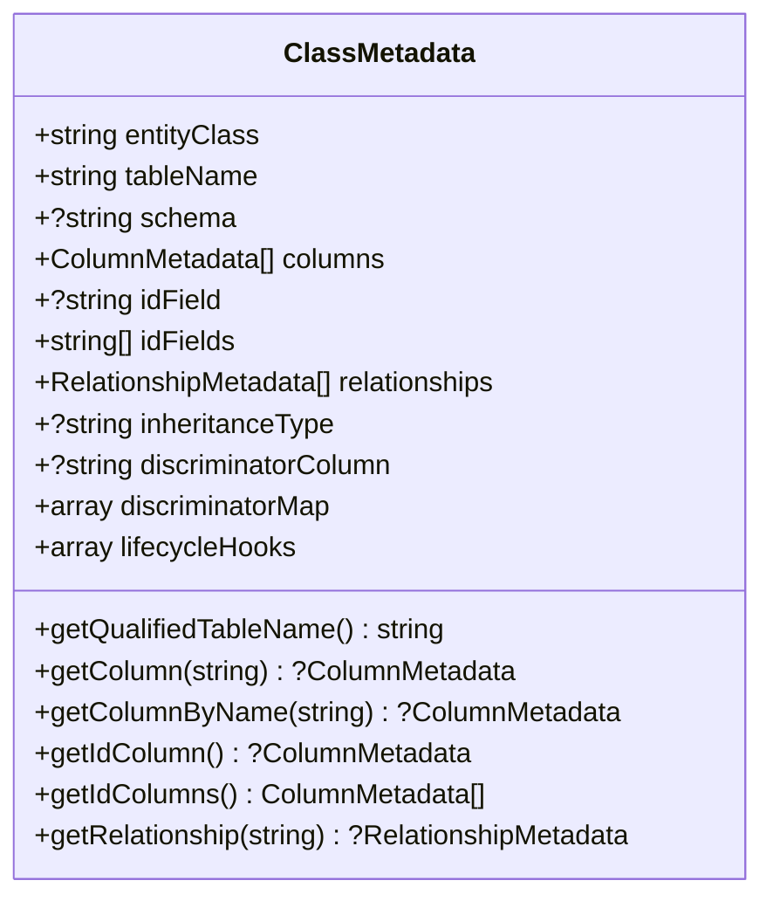
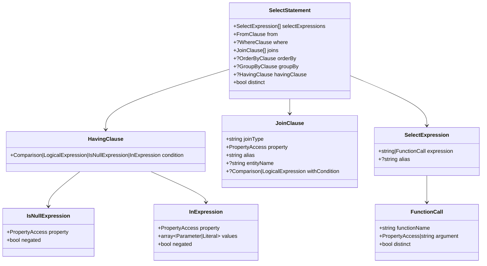

# Design Document: Insaculación Migration Gaps

## Overview

This document describes the technical design for closing 12 implementation gaps identified during the migration of the "Insaculación" project from Doctrine ORM to the `sybase-ase-orm-bundle`. The gaps span four areas:

1. **Composite Primary Keys** (Requirements 1–4): Extend metadata, persistence, identity map, and find() to support multi-column primary keys while preserving backward compatibility for single-key entities.
2. **OQL Language Extensions** (Requirements 5–9): Add IS NULL/IS NOT NULL, IN/NOT IN, aggregate functions (COUNT, SUM, AVG, MIN, MAX) with DISTINCT and HAVING, entity-based JOIN with WITH conditions, SELECT * wildcard, and column aliases to the OQL parser, printer, and SQL translator.
3. **Hydration & Query API** (Requirements 10–11): Add scalar/array hydration mode to EntityManager::query() and HAVING support to QueryBuilder.
4. **Charset Conversion** (Requirement 12): Transparent UTF-8 ↔ ISO-8859-1 conversion in ConnectionManager.

### Key Design Decisions

1. **`idFields` as array, `idField` preserved**: `ClassMetadata` gains a new `$idFields` array property. The existing `$idField` remains as a computed alias pointing to the first element, ensuring all 524 existing tests pass without modification.
2. **Composite key string for IdentityMap**: Composite keys are serialized to a deterministic string `"val1|val2|..."` using a pipe separator. Scalar keys continue to use `(string) $id` as before.
3. **New AST nodes as final readonly classes**: `IsNullExpression`, `InExpression`, `FunctionCall`, and `HavingClause` follow the existing AST pattern — `final class` with constructor promotion and `readonly` properties.
4. **Union types in WhereClause/LogicalExpression**: The condition type unions are extended to include `IsNullExpression` and `InExpression` alongside `Comparison` and `LogicalExpression`.
5. **JoinClause dual mode**: `JoinClause` gains optional `?string $entityName` and `?Comparison|LogicalExpression $withCondition` properties. When `entityName` is set, the translator resolves it to a table name and uses `withCondition` as the ON clause. The existing `PropertyAccess $property` path remains for relationship-based joins.
6. **Hydration mode enum**: A simple class with constants (`HYDRATE_OBJECT = 1`, `HYDRATE_ARRAY = 2`) rather than a PHP enum, for simplicity and PHP 8.1 compatibility with existing patterns.
7. **Charset conversion at ConnectionManager boundary**: Conversion happens in `executeQuery()` and `executeStatement()` (outbound) and in a new `convertResultCharset()` method called after fetch (inbound), keeping the conversion logic centralized.
8. **Parameter expansion for IN clauses**: The EntityManager expands array parameters into individual positional placeholders before passing to ConnectionManager, keeping the ConnectionManager unaware of OQL semantics.

## Architecture

### Component Interaction Diagram

```mermaid
graph TB
    subgraph "Modified Components"
        CM_mod["ClassMetadata<br/>(+idFields, +getIdColumns)"]
        MR_mod["MetadataReader<br/>(accumulate multiple #[Id])"]
        IM_mod["IdentityMap<br/>(composite key string)"]
        UoW_mod["UnitOfWork<br/>(composite WHERE)"]
        EM_mod["EntityManager<br/>(composite find, hydration mode, IN expansion)"]
        HY_mod["Hydrator<br/>(composite key lookup, scalar mode)"]
        QB_mod["QueryBuilder<br/>(+having)"]
        CONN_mod["ConnectionManager<br/>(+charset conversion)"]
        CONF_mod["Configuration<br/>(+charset_conversion)"]
    end

    subgraph "New AST Nodes"
        ISN["IsNullExpression"]
        INE["InExpression"]
        FC["FunctionCall"]
        HC["HavingClause"]
    end

    subgraph "Modified AST Nodes"
        SS_mod["SelectStatement<br/>(+havingClause, +distinct)"]
        JC_mod["JoinClause<br/>(+entityName, +withCondition)"]
        SE_mod["SelectExpression<br/>(wildcard support)"]
    end

    subgraph "Modified Query Layer"
        OP_mod["OqlParser<br/>(extended grammar)"]
        OPR_mod["OqlPrinter<br/>(new node printing)"]
        OT_mod["OqlToSqlTranslator<br/>(new node translation)"]
    end

    MR_mod --> CM_mod
    EM_mod --> IM_mod
    EM_mod --> UoW_mod
    EM_mod --> HY_mod
    EM_mod --> OP_mod
    OP_mod --> ISN
    OP_mod --> INE
    OP_mod --> FC
    OP_mod --> HC
    OP_mod --> SS_mod
    OP_mod --> JC_mod
    OPR_mod --> ISN
    OPR_mod --> INE
    OPR_mod --> FC
    OPR_mod --> HC
    OT_mod --> ISN
    OT_mod --> INE
    OT_mod --> FC
    OT_mod --> HC
    OT_mod --> JC_mod
    CONN_mod --> CONF_mod

```



## Components and Interfaces

### 1. Composite Primary Key — Metadata Layer

#### ClassMetadata Changes

```php
// src/Metadata/ClassMetadata.php
final class ClassMetadata
{
    /** @var string[] Property names of all primary key fields */
    public readonly array $idFields;

    // Existing $idField remains for backward compatibility (first element or null)
    public readonly ?string $idField;

    /**
     * Returns ColumnMetadata[] for all primary key fields.
     * @return ColumnMetadata[]
     */
    public function getIdColumns(): array;

    // Existing getIdColumn() returns first Id column (unchanged contract)
    public function getIdColumn(): ?ColumnMetadata;
}
```

**Construction**: The constructor accepts the new `$idFields` array parameter (defaulting to `[]`). If `$idFields` is empty but `$idField` is provided, `$idFields` is computed as `[$idField]`. If `$idFields` is non-empty, `$idField` is set to `$idFields[0]`. The pre-computed `columnsByProperty` and `columnsByName` maps remain unchanged.

#### MetadataReader Changes

```php
// src/Metadata/MetadataReader.php — in readColumnMetadata loop
// Current: sets $idField to the single property name when isId is true
// New: accumulates all isId property names into $idFields array
$idFields = [];
foreach ($classHierarchy as $hierarchyClass) {
    foreach ($hierarchyClass->getProperties() as $property) {
        // ... existing column reading ...
        if ($columnMeta->isId) {
            $idFields[] = $columnMeta->propertyName;
        }
    }
}
// Pass $idFields to ClassMetadata constructor
```

### 2. Composite Primary Key — Persistence Layer

#### IdentityMap / IdentityMapInterface Changes

```php
// src/ORM/IdentityMapInterface.php — no signature change needed
// The $id parameter is already typed as `mixed`, accepting both scalar and array

// src/ORM/IdentityMap.php — internal key derivation
final class IdentityMap implements IdentityMapInterface
{
    /**
     * Derives a deterministic string key from a scalar or composite id.
     * Scalar: (string) $id
     * Array:  implode('|', sorted-by-key values)
     */
    private function deriveKey(mixed $id): string
    {
        if (is_array($id)) {
            ksort($id); // deterministic ordering
            return implode('|', array_map('strval', $id));
        }
        return (string) $id;
    }

    public function put(string $entityClass, mixed $id, object $entity): void
    {
        $this->map[$entityClass][$this->deriveKey($id)] = $entity;
    }

    public function get(string $entityClass, mixed $id): ?object
    {
        return $this->map[$entityClass][$this->deriveKey($id)] ?? null;
    }

    public function contains(string $entityClass, mixed $id): bool
    {
        return isset($this->map[$entityClass][$this->deriveKey($id)]);
    }

    public function remove(string $entityClass, mixed $id): void
    {
        unset($this->map[$entityClass][$this->deriveKey($id)]);
    }
}
```

#### UnitOfWork Changes

The `executeUpdates()` and `executeDeletes()` methods currently build a single-column WHERE clause using `getIdColumn()`. They will be updated to:

1. Call `$metadata->getIdColumns()` to get all id columns.
2. Build a WHERE clause with one `column = ?` per id column, joined with ` AND `.
3. Collect all id values in order and append them to the parameter array.

```php
// Helper method in UnitOfWork
private function buildCompositeWhereClause(ClassMetadata $metadata, object $entity): array
{
    $idColumns = $metadata->getIdColumns();
    $conditions = [];
    $values = [];

    foreach ($idColumns as $idCol) {
        $refProp = $this->getReflectionProperty($entity::class, $idCol->propertyName);
        $idValue = $refProp->getValue($entity);
        $conditions[] = $this->dialect->quoteIdentifier($idCol->columnName) . ' = ?';
        $values[] = $this->typeCaster->toDatabaseValue($idValue, $idCol->type);
    }

    return [implode(' AND ', $conditions), $values];
}
```

For single-key entities, `getIdColumns()` returns a single-element array, so the same code path produces the same SQL as before.

#### EntityManager::find() Changes

```php
public function find(string $entityClass, mixed $id): ?object
{
    // 1. IdentityMap lookup (works with both scalar and array)
    $entity = $this->identityMap->get($entityClass, $id);
    if ($entity !== null) return $entity;

    // 2. CacheManager lookup
    $entity = $this->cacheManager->get($entityClass, $id);
    if ($entity !== null) { /* ... */ return $entity; }

    // 3. Build query
    $metadata = $this->metadataReader->getClassMetadata($entityClass);

    if (is_array($id)) {
        // Composite key: validate keys match declared idFields
        $idColumns = $metadata->getIdColumns();
        $declaredFields = array_map(fn($c) => $c->propertyName, $idColumns);
        $providedFields = array_keys($id);
        sort($declaredFields);
        sort($providedFields);
        if ($declaredFields !== $providedFields) {
            throw new PersistenceException(/* mismatch message */);
        }

        // Build multi-column WHERE
        $conditions = [];
        $dbValues = [];
        foreach ($idColumns as $idCol) {
            $conditions[] = $this->dialect->quoteIdentifier($idCol->columnName) . ' = ?';
            $dbValues[] = $this->typeCaster->toDatabaseValue($id[$idCol->propertyName], $idCol->type);
        }
        $whereClause = implode(' AND ', $conditions);
    } else {
        // Single key: existing behavior
        $idColumn = $metadata->getIdColumn();
        if ($idColumn === null) return null;
        $whereClause = $this->dialect->quoteIdentifier($idColumn->columnName) . ' = ?';
        $dbValues = [$this->typeCaster->toDatabaseValue($id, $idColumn->type)];
    }

    $sql = $this->dialect->generateSelect(['*'], $metadata->getQualifiedTableName());
    $sql .= ' WHERE ' . $whereClause;

    // ... execute, hydrate, register (unchanged) ...
}
```

### 3. Hydrator Changes

#### Composite Key Identity Map Integration

```php
// In resolveFromIdentityMap(): use all id columns
private function resolveFromIdentityMap(array $row, ClassMetadata $metadata): ?object
{
    $idColumns = $metadata->getIdColumns();
    if (empty($idColumns)) return null;

    if (count($idColumns) === 1) {
        // Single key: existing fast path
        $idCol = $idColumns[0];
        $idValue = $row[$idCol->columnName] ?? null;
        if ($idValue === null) return null;
        $idValue = $this->typeCaster->toPhpValue($idValue, $idCol->type);
        return $this->identityMap->get($metadata->entityClass, $idValue);
    }

    // Composite key: build associative array
    $compositeId = [];
    foreach ($idColumns as $idCol) {
        $val = $row[$idCol->columnName] ?? null;
        if ($val === null) return null;
        $compositeId[$idCol->propertyName] = $this->typeCaster->toPhpValue($val, $idCol->type);
    }
    return $this->identityMap->get($metadata->entityClass, $compositeId);
}

// In storeInIdentityMap(): use all id columns
private function storeInIdentityMap(object $entity, ClassMetadata $metadata): void
{
    $idColumns = $metadata->getIdColumns();
    if (empty($idColumns)) return;

    if (count($idColumns) === 1) {
        // Single key: existing fast path
        $idCol = $idColumns[0];
        $refClass = $this->getReflectionClass($entity::class);
        $idValue = $this->getPropertyValue($entity, $idCol->propertyName, $refClass);
        if ($idValue === null) return;
        $this->identityMap->put($metadata->entityClass, $idValue, $entity);
        return;
    }

    // Composite key
    $compositeId = [];
    $refClass = $this->getReflectionClass($entity::class);
    foreach ($idColumns as $idCol) {
        $val = $this->getPropertyValue($entity, $idCol->propertyName, $refClass);
        if ($val === null) return;
        $compositeId[$idCol->propertyName] = $val;
    }
    $this->identityMap->put($metadata->entityClass, $compositeId, $entity);
}
```

#### Scalar/Array Hydration Mode

```php
// New constant class (or add to EntityManagerInterface)
final class HydrationMode
{
    public const HYDRATE_OBJECT = 1;
    public const HYDRATE_ARRAY = 2;
}
```

The `EntityManager::query()` method gains an optional `int $hydrationMode = HydrationMode::HYDRATE_OBJECT` parameter. When `HYDRATE_ARRAY`, it returns the raw `$rows` from PDO without hydration. Auto-detection logic checks if the AST contains `FunctionCall` nodes in select expressions, aliases, or multi-entity selects, and defaults to `HYDRATE_ARRAY` in those cases.

### 4. New AST Nodes

#### IsNullExpression

```php
// src/Query/AST/IsNullExpression.php
final class IsNullExpression
{
    public function __construct(
        public readonly PropertyAccess $property,
        public readonly bool $negated = false,
    ) {}
}
```

#### InExpression

```php
// src/Query/AST/InExpression.php
final class InExpression
{
    /**
     * @param array<Parameter|Literal> $values Single Parameter or list of Literals
     */
    public function __construct(
        public readonly PropertyAccess $property,
        public readonly array $values,
        public readonly bool $negated = false,
    ) {}
}
```

#### FunctionCall

```php
// src/Query/AST/FunctionCall.php
final class FunctionCall
{
    public function __construct(
        public readonly string $functionName,       // COUNT, SUM, AVG, MIN, MAX
        public readonly PropertyAccess|string $argument, // PropertyAccess or '*'
        public readonly bool $distinct = false,
    ) {}
}
```

#### HavingClause

```php
// src/Query/AST/HavingClause.php
final class HavingClause
{
    public function __construct(
        public readonly Comparison|LogicalExpression|IsNullExpression|InExpression $condition,
    ) {}
}
```

### 5. Modified AST Nodes

#### SelectStatement

```php
// Add optional havingClause and distinct flag
final class SelectStatement
{
    public function __construct(
        public readonly array $selectExpressions,
        public readonly FromClause $from,
        public readonly ?WhereClause $where = null,
        public readonly array $joins = [],
        public readonly ?OrderByClause $orderBy = null,
        public readonly ?GroupByClause $groupBy = null,
        public readonly ?HavingClause $havingClause = null,
        public readonly bool $distinct = false,
    ) {}
}
```

#### JoinClause — Dual Mode

```php
final class JoinClause
{
    public function __construct(
        public readonly string $joinType,
        public readonly PropertyAccess $property,
        public readonly string $alias,
        public readonly ?string $entityName = null,
        public readonly Comparison|LogicalExpression|null $withCondition = null,
    ) {}
}
```

When `$entityName !== null`, this is an entity-based join. The `$property` field is set to a dummy `PropertyAccess('', '')` (or the entity name can be stored there — but keeping a separate field is cleaner for the printer/translator to distinguish modes).

**Design decision**: For entity-based joins, `$property` is set to `new PropertyAccess($entityName, '')` as a convention. The translator checks `$entityName !== null` to determine the join mode.

#### WhereClause / LogicalExpression — Extended Union Types

```php
// WhereClause
final class WhereClause
{
    public function __construct(
        public readonly Comparison|LogicalExpression|IsNullExpression|InExpression $condition,
    ) {}
}

// LogicalExpression
final class LogicalExpression
{
    public function __construct(
        public readonly Comparison|LogicalExpression|IsNullExpression|InExpression $left,
        public readonly string $operator,
        public readonly Comparison|LogicalExpression|IsNullExpression|InExpression $right,
    ) {}
}
```

#### SelectExpression — FunctionCall Support

The existing `SelectExpression` uses a `string $expression` field. To support `FunctionCall` in SELECT, the expression field can hold either a string (property access, wildcard `*`) or a `FunctionCall` object:

```php
final class SelectExpression
{
    public function __construct(
        public readonly string|FunctionCall $expression,
        public readonly ?string $alias = null,
    ) {}
}
```

### 6. OQL Parser Extensions

The parser grammar is extended to support:

```
selectExpression := '*'
                  | functionCall ['AS' identifier]
                  | propertyAccess ['AS' identifier]
                  | identifier ['AS' identifier]

functionCall := ('COUNT' | 'SUM' | 'AVG' | 'MIN' | 'MAX') '(' ['DISTINCT'] (propertyAccess | '*') ')'

condition := comparison
           | isNullExpr
           | inExpr
           | condition ('AND' | 'OR') condition

isNullExpr := propertyAccess 'IS' ['NOT'] 'NULL'

inExpr := propertyAccess ['NOT'] 'IN' '(' valueList ')'
valueList := parameter | literal (',' literal)*

joinClause := ('JOIN' | 'LEFT' 'JOIN') (propertyAccess alias | entityName alias 'WITH' condition)

selectStatement := 'SELECT' ['DISTINCT'] selectExpressions
                   'FROM' entityName alias
                   [joinClause]*
                   ['WHERE' condition]
                   ['GROUP' 'BY' groupByList]
                   ['HAVING' condition]
                   ['ORDER' 'BY' orderByList]
```

Key parsing changes:
- `parseSelectExpression()`: Check for `*`, aggregate function names, or `AS` keyword after expression.
- `parseCondition()`: After parsing left operand, check for `IS` (→ IsNullExpression) or `NOT IN` / `IN` (→ InExpression) before falling through to comparison operators.
- `parseJoinClause()`: After consuming JOIN keyword, peek ahead. If the next token contains a dot, it's a relationship-based join. Otherwise, it's an entity-based join — consume entity name, alias, expect `WITH`, parse condition.
- `parseSelectStatement()`: Check for `DISTINCT` after `SELECT`. Check for `HAVING` after `GROUP BY`.

### 7. OQL Printer Extensions

The printer gains methods for each new AST node type:

- `printIsNullExpression(IsNullExpression $expr)`: Emits `alias.property IS [NOT] NULL`
- `printInExpression(InExpression $expr)`: Emits `alias.property [NOT] IN (:param)` or `alias.property [NOT] IN (val1, val2, ...)`
- `printFunctionCall(FunctionCall $fc)`: Emits `FUNC([DISTINCT] alias.property)` or `FUNC(*)`
- `printHavingClause(HavingClause $hc)`: Emits `HAVING condition`
- `printJoinClause()` updated: When `entityName` is set, emits `JOIN EntityName alias WITH condition`
- `printSelectExpressions()` updated: Handles `FunctionCall` in expression field, `*` wildcard, and `DISTINCT` keyword
- `print()` updated: Emits `HAVING` clause after `GROUP BY` if present, emits `DISTINCT` after `SELECT` if set

### 8. OQL-to-SQL Translator Extensions

- `resolveIsNull(IsNullExpression)`: Resolves property to column, emits `column IS [NOT] NULL`
- `resolveInExpression(InExpression)`: Resolves property to column, emits `column [NOT] IN (...)` with parameter collection
- `resolveFunctionCall(FunctionCall)`: Emits `FUNC([DISTINCT] column)` or `FUNC(*)`
- `resolveHaving(HavingClause)`: Emits `HAVING` + resolved condition
- `resolveJoin()` updated: When `entityName` is set, resolves entity to table, registers alias→entity mapping, emits `JOIN [table] [alias] ON condition`
- `resolveSelect()` updated: Handles `FunctionCall` expressions, `*` wildcard, aliases with `AS`
- `resolveCondition()` updated: Handles `IsNullExpression` and `InExpression` in addition to `Comparison` and `LogicalExpression`

### 9. QueryBuilder HAVING Support

```php
// src/Query/QueryBuilder.php
final class QueryBuilder implements QueryBuilderInterface
{
    private ?string $havingCondition = null;

    public function having(string $condition, array $params = []): static
    {
        $this->havingCondition = $condition;
        $this->parameters = array_merge($this->parameters, $params);
        return $this;
    }

    // In getSQL(), after buildGroupByClause():
    private function buildHavingClause(): string
    {
        if ($this->havingCondition === null) return '';
        return ' HAVING ' . $this->havingCondition;
    }
}

// src/Query/QueryBuilderInterface.php
interface QueryBuilderInterface
{
    // ... existing methods ...
    /** Agrega una condición HAVING a la consulta. */
    public function having(string $condition, array $params = []): static;
}
```

### 10. Charset Conversion

```php
// src/Connection/ConnectionManager.php
class ConnectionManager implements ConnectionManagerInterface
{
    private bool $charsetConversion;

    public function __construct(array $config)
    {
        // ... existing config ...
        $this->charsetConversion = (bool) ($config['charset_conversion'] ?? false);
    }

    /**
     * Converts a UTF-8 string to ISO-8859-1 for database output.
     * Characters not representable in ISO-8859-1 are preserved as-is.
     */
    private function convertToDatabase(string $value): string
    {
        $converted = @iconv('UTF-8', 'ISO-8859-1//TRANSLIT', $value);
        return $converted !== false ? $converted : $value;
    }

    /**
     * Converts an ISO-8859-1 string from the database to UTF-8.
     */
    private function convertFromDatabase(string $value): string
    {
        $converted = @iconv('ISO-8859-1', 'UTF-8', $value);
        return $converted !== false ? $converted : $value;
    }

    // In executeQuery() and executeStatement():
    // Before execute, if charsetConversion is enabled, convert string params
    private function convertParams(array $params): array
    {
        if (!$this->charsetConversion) return $params;
        return array_map(fn($v) => is_string($v) ? $this->convertToDatabase($v) : $v, $params);
    }

    // After fetch, convert string result values
    public function convertResultRow(array $row): array
    {
        if (!$this->charsetConversion) return $row;
        return array_map(fn($v) => is_string($v) ? $this->convertFromDatabase($v) : $v, $row);
    }
}
```

#### Configuration Changes

```php
// src/DependencyInjection/Configuration.php — add under connection node:
->booleanNode('charset_conversion')
    ->defaultFalse()
    ->info('Habilita conversión transparente UTF-8 ↔ ISO-8859-1.')
->end()
```

## Data Models

### Modified ClassMetadata



### New AST Node Hierarchy



### HydrationMode Constants

```php
final class HydrationMode
{
    public const HYDRATE_OBJECT = 1;
    public const HYDRATE_ARRAY = 2;
}
```

### ConnectionManager Config Extension

```yaml
# config/packages/sybase_orm.yaml
sybase_orm:
    connection:
        # ... existing fields ...
        charset_conversion: false  # new, defaults to false
```

## Correctness Properties

*A property is a characteristic or behavior that should hold true across all valid executions of a system — essentially, a formal statement about what the system should do. Properties serve as the bridge between human-readable specifications and machine-verifiable correctness guarantees.*

### Property 1: ClassMetadata Id Column Accessor Consistency

*For any* `ClassMetadata` constructed with a set of columns where one or more have `isId = true`, `getIdColumns()` SHALL return exactly those columns (same count, same property names, all with `isId = true`), and `getIdColumn()` SHALL return the first element of `getIdColumns()`.

**Validates: Requirements 1.3, 1.4**

### Property 2: Composite Key Persistence WHERE Clause Completeness

*For any* entity with N primary key columns (N ≥ 1), the WHERE clause generated by the UnitOfWork for UPDATE and DELETE operations SHALL contain exactly N equality conditions joined with AND, one per primary key column.

**Validates: Requirements 2.1, 2.2, 2.3, 2.4**

### Property 3: IdentityMap Composite Key Round-Trip

*For any* entity class and any composite key (associative array of key-value pairs), storing the entity via `put()` and then retrieving it via `get()` with the same key values SHALL return the same entity instance. Furthermore, two different composite key arrays (differing in at least one value) SHALL map to different entries.

**Validates: Requirements 3.1, 3.2, 3.3**

### Property 4: OQL Parse–Print–Parse Round-Trip

*For any* valid OQL `SelectStatement` AST — including those containing `IS NULL`, `IS NOT NULL`, `IN`, `NOT IN`, aggregate functions (`COUNT`, `SUM`, `AVG`, `MIN`, `MAX`), `DISTINCT`, `HAVING` clauses, entity-based `JOIN ... WITH` conditions, `SELECT *` wildcards, and column aliases — printing the AST to OQL text and then parsing that text SHALL produce an AST equivalent to the original.

**Validates: Requirements 5.5, 6.7, 7.10, 8.6, 9.6**

### Property 5: IN Parameter Expansion Placeholder Count

*For any* array parameter of N elements bound to an `IN` expression, the EntityManager's parameter expansion SHALL produce exactly N positional placeholders in the SQL output, and the ordered parameter array SHALL contain exactly those N values in order.

**Validates: Requirement 6.4**

### Property 6: QueryBuilder HAVING Clause Inclusion

*For any* non-empty HAVING condition string passed to `QueryBuilder::having()`, the SQL produced by `getSQL()` SHALL contain a `HAVING` clause with that condition, positioned after the `GROUP BY` clause (if present) and before the `ORDER BY` clause (if present).

**Validates: Requirements 11.1, 11.2**

### Property 7: Charset Conversion Round-Trip

*For any* string containing only characters representable in ISO-8859-1, converting from UTF-8 to ISO-8859-1 (outbound) and then from ISO-8859-1 back to UTF-8 (inbound) SHALL produce a string identical to the original.

**Validates: Requirements 12.1, 12.2**

## Error Handling

### Composite Key Errors

| Scenario | Exception | Message Pattern |
|---|---|---|
| `find()` receives array with keys not matching entity's `idFields` | `PersistenceException` | `"Key mismatch for entity X: expected [a, b], got [c, d]"` |
| `find()` receives array for entity with single key | Works normally (single-element array is valid) | — |
| Entity with composite key has null value in one key column | `PersistenceException` | `"Null value in composite key column X for entity Y"` |

### OQL Parse Errors

| Scenario | Exception | Message Pattern |
|---|---|---|
| `IS` not followed by `NULL` or `NOT NULL` | `OqlParseException` | `'Expected "NULL" or "NOT", got "X" at position N'` |
| `IN` not followed by `(` | `OqlParseException` | `'Expected "(", got "X" at position N'` |
| Unknown aggregate function name | `OqlParseException` | `'Unknown function "X" at position N'` |
| `HAVING` without valid condition | `OqlParseException` | `'Unexpected end of OQL query'` |
| Entity-based JOIN without `WITH` | `OqlParseException` | `'Expected "WITH" after entity join alias'` |
| Entity name in JOIN not found in registered entities | `RuntimeException` (from translator) | `'Cannot resolve entity name "X"'` |

### Charset Conversion Errors

| Scenario | Behavior |
|---|---|
| String contains characters not representable in ISO-8859-1 | `iconv` with `//TRANSLIT` attempts transliteration; on failure, original string is preserved (no exception) |
| `iconv` extension not available | PHP will throw a fatal error at call site; this is a deployment prerequisite |

### Backward Compatibility Guarantees

- All existing `EntityManagerInterface`, `IdentityMapInterface`, `UnitOfWorkInterface`, `HydratorInterface`, `QueryBuilderInterface` method signatures remain unchanged or gain only optional parameters with defaults matching current behavior.
- `ClassMetadata::$idField` and `getIdColumn()` continue to work for single-key entities.
- `IdentityMap` with scalar `$id` values produces the same string key as before (`(string) $id`).
- `EntityManager::query()` without a hydration mode parameter returns entity objects as before.
- The 524 existing tests must pass without modification.

## Testing Strategy

### Unit Tests (Example-Based)

Unit tests cover specific scenarios, edge cases, and backward compatibility:

**Metadata Layer:**
- Single `#[Id]` entity produces `idFields = ['id']` and `idField = 'id'`
- Multiple `#[Id]` entity produces `idFields = ['orgId', 'userId']`
- `getIdColumns()` returns correct `ColumnMetadata` objects
- `getIdColumn()` returns first id column for composite entities
- Backward compatibility: existing single-key entity metadata unchanged

**OQL Parser:**
- Parse `IS NULL` → `IsNullExpression(negated: false)`
- Parse `IS NOT NULL` → `IsNullExpression(negated: true)`
- Parse `IN (:param)` → `InExpression(negated: false, values: [Parameter])`
- Parse `NOT IN (:param)` → `InExpression(negated: true)`
- Parse `IN (1, 2, 3)` → `InExpression(values: [Literal, Literal, Literal])`
- Parse `COUNT(u.id)` → `FunctionCall('COUNT', PropertyAccess)`
- Parse `COUNT(DISTINCT u.status)` → `FunctionCall('COUNT', ..., distinct: true)`
- Parse `SUM(...)`, `AVG(...)`, `MIN(...)`, `MAX(...)` → correct function names
- Parse `HAVING COUNT(u.id) > 5` → `HavingClause` with `Comparison`
- Parse `JOIN Order o WITH o.userId = u.id` → entity-based `JoinClause`
- Parse `LEFT JOIN Order o WITH ...` → `joinType = 'LEFT JOIN'`
- Parse `SELECT *` → wildcard `SelectExpression`
- Parse `u.name AS userName` → `SelectExpression` with alias
- Parse `SELECT DISTINCT` → `SelectStatement(distinct: true)`
- Existing relationship-based JOIN still works
- Error cases: malformed IS NULL, unclosed IN parenthesis, unknown function

**OQL Printer:**
- Print each new AST node type and verify OQL text output
- Print entity-based JoinClause with WITH condition

**OQL Translator:**
- Translate IS NULL/IS NOT NULL to SQL
- Translate IN/NOT IN to SQL with parameter collection
- Translate aggregate functions to SQL with column resolution
- Translate HAVING clause to SQL
- Translate entity-based JOIN to SQL with table resolution
- Translate SELECT * and aliases to SQL

**IdentityMap:**
- Scalar key put/get (backward compatibility)
- Composite key put/get
- Composite key contains/remove
- Different composite keys don't collide

**UnitOfWork:**
- Single-key UPDATE generates single WHERE condition
- Composite-key UPDATE generates AND-joined WHERE conditions
- Single-key DELETE generates single WHERE condition
- Composite-key DELETE generates AND-joined WHERE conditions

**EntityManager:**
- `find()` with scalar id (backward compatibility)
- `find()` with composite array id
- `find()` with mismatched keys throws `PersistenceException`
- `query()` with `HYDRATE_ARRAY` returns arrays
- `query()` with `HYDRATE_OBJECT` returns entities
- `query()` with aggregates auto-detects array mode

**QueryBuilder:**
- `having()` stores condition
- `getSQL()` includes HAVING after GROUP BY
- `having()` without `groupBy()` still includes HAVING

**Charset Conversion:**
- Conversion disabled: strings pass through unchanged
- Conversion enabled: UTF-8 → ISO-8859-1 for outbound
- Conversion enabled: ISO-8859-1 → UTF-8 for inbound
- Non-representable characters preserved without corruption
- Configuration defaults to false

### Property-Based Tests

Property-based tests use PHPUnit with a custom data provider generating random inputs (minimum 100 iterations per property). The project uses PHPUnit 10, so property tests will be implemented using `@dataProvider` methods with random generation helpers.

Each property test references its design document property:

- **Feature: insaculacion-migration-gaps, Property 1: ClassMetadata Id Column Accessor Consistency** — Generate random column sets with varying numbers of `isId=true` columns, construct `ClassMetadata`, verify `getIdColumns()` and `getIdColumn()` invariants.

- **Feature: insaculacion-migration-gaps, Property 2: Composite Key Persistence WHERE Clause Completeness** — Generate entities with 1–5 id columns, mock the ConnectionManager, trigger UPDATE/DELETE via UnitOfWork, capture SQL, verify AND-joined condition count matches id column count.

- **Feature: insaculacion-migration-gaps, Property 3: IdentityMap Composite Key Round-Trip** — Generate random composite key arrays (1–5 keys, random string/int values), put/get entities, verify identity. Generate pairs of different keys, verify they don't collide.

- **Feature: insaculacion-migration-gaps, Property 4: OQL Parse–Print–Parse Round-Trip** — Generate random OQL strings covering all new syntax (IS NULL, IN, aggregates, HAVING, entity JOINs, wildcards, aliases), parse to AST, print to OQL, parse again, compare ASTs for structural equivalence.

- **Feature: insaculacion-migration-gaps, Property 5: IN Parameter Expansion Placeholder Count** — Generate random arrays of 1–50 elements, bind to IN parameter, verify expanded SQL has matching placeholder count.

- **Feature: insaculacion-migration-gaps, Property 6: QueryBuilder HAVING Clause Inclusion** — Generate random condition strings, call `having()`, verify `getSQL()` output contains HAVING with the condition in correct position.

- **Feature: insaculacion-migration-gaps, Property 7: Charset Conversion Round-Trip** — Generate random strings from the ISO-8859-1 character range (0x20–0xFF), convert UTF-8→ISO-8859-1→UTF-8, verify identity.

### Test Configuration

- All property tests run minimum 100 iterations via data provider
- Each property test is tagged with a comment: `// Feature: insaculacion-migration-gaps, Property N: ...`
- Tests live in `tests/` mirroring the source structure
- New test fixtures for composite-key entities in `tests/Attribute/Fixtures/` or `tests/Metadata/Fixtures/`
- All existing 524 tests must continue to pass (backward compatibility gate)
