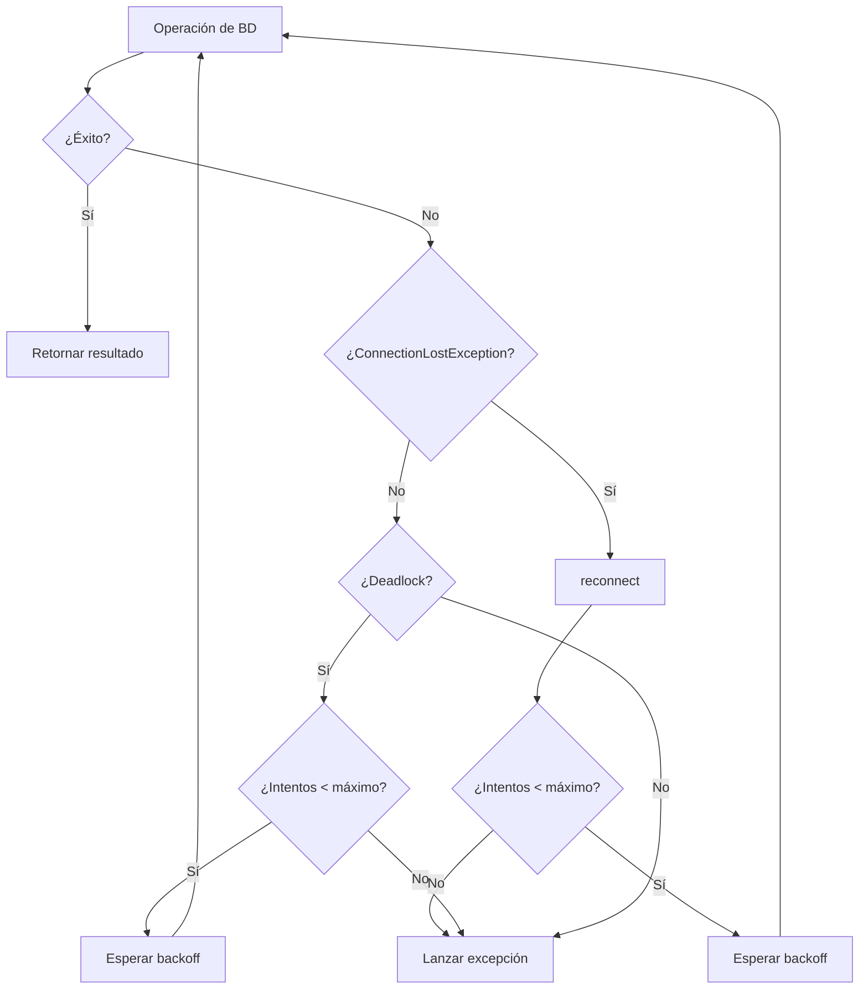

# Retry y Reconexión Automática

El ORM incluye mecanismos integrados para detectar conexiones perdidas y facilitar la reconexión a Sybase ASE. Este documento describe los patrones de retry, la reconexión automática y la configuración recomendada para entornos de producción.

## Detección de Conexión Perdida

`ConnectionManager` detecta automáticamente la pérdida de conexión mediante dos mecanismos:

### Códigos SQLSTATE

Se reconocen los siguientes códigos como indicadores de conexión perdida:

| Código | Significado |
|--------|-------------|
| `08S01` | Communication link failure |
| `08001` | Unable to connect |
| `HY000` | General error (frecuente con dblib) |

### Mensajes de Error

Además de los códigos, se analizan los mensajes de excepción buscando patrones como:

- `server has gone away`
- `lost connection`
- `connection reset`
- `broken pipe`
- `connection timed out`
- `no connection to the server`

Cuando se detecta una conexión perdida, `ConnectionManager` lanza `ConnectionLostException` con el código SQLSTATE original accesible vía `getSqlState()`.

## Método `ping()`

Verifica si la conexión actual está activa ejecutando `SELECT 1`:

```php
use SybaseORM\Connection\ConnectionManager;

$connection = new ConnectionManager($config);

if (!$connection->ping()) {
    // La conexión no responde, reconectar
    $connection->reconnect();
}
```

`ping()` retorna `true` si la conexión está activa, `false` si falló por cualquier motivo. Internamente captura cualquier `\Throwable`, por lo que es seguro llamarlo sin try/catch.

## Método `reconnect()`

Fuerza una reconexión limpiando el estado interno:

```php
$connection->reconnect();

// La próxima operación establecerá una nueva conexión
$result = $connection->executeQuery('SELECT * FROM users WHERE id = :id', ['id' => 1]);
```

`reconnect()` no establece la conexión inmediatamente. Limpia la conexión actual, la caché de sentencias preparadas, el estado de transacción y los savepoints. La nueva conexión se crea de forma lazy en la siguiente llamada a `getConnection()`.

## Detección de Deadlocks

`ConnectionManager::isDeadlock()` permite identificar si una excepción PDO corresponde a un deadlock de Sybase ASE:

```php
use SybaseORM\Connection\ConnectionManager;
use SybaseORM\Exception\PersistenceException;

try {
    $connection->executeStatement($sql, $params);
} catch (PersistenceException $e) {
    $previous = $e->getPrevious();
    if ($previous instanceof \PDOException && ConnectionManager::isDeadlock($previous)) {
        // Es un deadlock, aplicar retry
    }
}
```

El método busca en el mensaje de la excepción los indicadores: `deadlock`, `error 1205` o `chosen as the deadlock victim`.

## Flujo de Reconexión



## Patrón de Retry para Conexiones Perdidas

```php
use SybaseORM\Connection\ConnectionManager;
use SybaseORM\Exception\ConnectionLostException;

function executeWithRetry(
    ConnectionManager $connection,
    string $sql,
    array $params = [],
    int $maxRetries = 3,
    int $baseDelayMs = 100
): \PDOStatement {
    $attempts = 0;

    while (true) {
        try {
            return $connection->executeQuery($sql, $params);
        } catch (ConnectionLostException $e) {
            $attempts++;

            if ($attempts >= $maxRetries) {
                throw $e;
            }

            // Backoff exponencial con jitter
            $delay = $baseDelayMs * (2 ** ($attempts - 1));
            $jitter = random_int(0, (int) ($delay * 0.3));
            usleep(($delay + $jitter) * 1000);

            // Forzar reconexión
            $connection->reconnect();
        }
    }
}
```

## Patrón de Retry para Deadlocks

```php
use SybaseORM\Connection\ConnectionManager;
use SybaseORM\Exception\PersistenceException;

function executeWithDeadlockRetry(
    ConnectionManager $connection,
    callable $operation,
    int $maxRetries = 3,
    int $baseDelayMs = 50
): mixed {
    $attempts = 0;

    while (true) {
        try {
            return $operation($connection);
        } catch (PersistenceException $e) {
            $previous = $e->getPrevious();

            if (!$previous instanceof \PDOException || !ConnectionManager::isDeadlock($previous)) {
                throw $e; // No es deadlock, propagar
            }

            $attempts++;

            if ($attempts >= $maxRetries) {
                throw $e;
            }

            // Delay aleatorio para reducir colisiones
            $delay = random_int($baseDelayMs, $baseDelayMs * (2 ** $attempts));
            usleep($delay * 1000);
        }
    }
}

// Uso
$result = executeWithDeadlockRetry($connection, function (ConnectionManager $conn) {
    $conn->beginTransaction();
    $conn->executeStatement('UPDATE accounts SET balance = balance - 100 WHERE id = :from', ['from' => 1]);
    $conn->executeStatement('UPDATE accounts SET balance = balance + 100 WHERE id = :to', ['to' => 2]);
    $conn->commit();
    return true;
});
```

## Patrón Combinado: Retry con Reconexión y Deadlocks

Combina ambos patrones en un solo wrapper que maneja `ConnectionLostException` (con `reconnect()`) y deadlocks (con delay aleatorio):

```php
use SybaseORM\Connection\ConnectionManager;
use SybaseORM\Exception\ConnectionLostException;
use SybaseORM\Exception\PersistenceException;

function resilientExecute(ConnectionManager $connection, callable $operation, int $maxRetries = 3): mixed {
    $attempts = 0;
    while (true) {
        try {
            return $operation($connection);
        } catch (ConnectionLostException $e) {
            if (++$attempts >= $maxRetries) { throw $e; }
            usleep((100 * (2 ** ($attempts - 1)) + random_int(0, 50)) * 1000);
            $connection->reconnect();
        } catch (PersistenceException $e) {
            $prev = $e->getPrevious();
            if (!$prev instanceof \PDOException || !ConnectionManager::isDeadlock($prev)) { throw $e; }
            if (++$attempts >= $maxRetries) { throw $e; }
            usleep(random_int(100, 300) * 1000);
        }
    }
}
```

## Configuración Recomendada para Producción

### Parámetros de Retry

| Parámetro | Desarrollo | Producción | Descripción |
|-----------|-----------|------------|-------------|
| `maxRetries` | 1 | 3 | Intentos máximos antes de fallar |
| `baseDelayMs` | 50 | 100–200 | Delay base entre reintentos (ms) |
| Backoff | Lineal | Exponencial | Estrategia de incremento del delay |
| Jitter | No | Sí (30%) | Variación aleatoria para evitar thundering herd |

### Health Check con `ping()`

Para procesos de larga duración (workers, daemons), verificar la conexión periódicamente:

```php
while ($job = $queue->pop()) {
    if (!$connection->ping()) {
        $connection->reconnect();
    }
    try {
        processJob($job, $connection);
    } catch (ConnectionLostException $e) {
        $connection->reconnect();
        $queue->retry($job);
    }
}
```

### Conexiones Persistentes y Reconexión

Con conexiones persistentes (`'persistent' => true`), la reconexión invalida la conexión reutilizada. Usar `ping()` al inicio de cada request, configurar timeouts del servidor mayores que el timeout de PHP, y monitorear reconexiones como indicador de inestabilidad.

### Timeouts Recomendados

```ini
; php.ini - Configuración de timeouts para producción
pdo_dblib.timeout = 30         ; Timeout de conexión (segundos)
default_socket_timeout = 30    ; Timeout de socket
max_execution_time = 60        ; Tiempo máximo de ejecución del script
```

## Monitoreo de Reconexiones

Integrar con PSR-3 Logger para rastrear reconexiones:

```php
use Psr\Log\LoggerInterface;
use SybaseORM\Exception\ConnectionLostException;

function executeWithMonitoring(ConnectionManager $connection, LoggerInterface $logger, string $sql, array $params = []): \PDOStatement {
    try {
        return $connection->executeQuery($sql, $params);
    } catch (ConnectionLostException $e) {
        $logger->warning('Conexión perdida, reconectando', [
            'sqlState' => $e->getSqlState(),
        ]);
        $connection->reconnect();
        return $connection->executeQuery($sql, $params);
    }
}
```

### Métricas Clave

| Métrica | Umbral de Alerta | Acción |
|---------|-----------------|--------|
| Reconexiones/minuto | > 5 | Investigar red/servidor |
| Deadlocks/minuto | > 10 | Revisar concurrencia de queries |
| Retries agotados/hora | > 0 | Escalar inmediatamente |
| Tiempo medio de reconexión | > 2s | Revisar latencia de red |

## Buenas Prácticas

1. **Backoff exponencial con jitter** para evitar saturar el servidor tras recuperación.
2. **Limitar a 3 reintentos** máximo en producción.
3. **No reintentar operaciones no idempotentes** sin verificar estado previo.
4. **Separar retry de conexión vs deadlock** — causas y estrategias diferentes.
5. **Monitorear reconexiones** como señal temprana de problemas de infraestructura.
6. **Usar `ping()` preventivamente** en procesos de larga duración, no en cada request.

---

← [Anterior](./troubleshooting.md) | [Índice](./README.md) | [Siguiente →](./migraciones-produccion.md)
