# Arquitectura General

El ORM se organiza en capas con responsabilidades bien definidas. Cada capa encapsula una preocupación específica y expone interfaces que las capas superiores consumen. Este diseño permite sustituir implementaciones (por ejemplo, cambiar el adaptador de caché) sin afectar al resto del sistema.

## Diagrama de Capas

```mermaid
graph TD
    subgraph "Capa de Aplicación"
        EM[EntityManager]
        REPO[EntityRepository]
    end

    subgraph "Capa ORM"
        UOW[UnitOfWork]
        IM[IdentityMap]
        HYD[Hydrator]
        INH[InheritanceHandler]
    end

    subgraph "Capa de Consultas"
        QB[QueryBuilder]
        PARSER[OqlParser]
        TRANS[OqlToSqlTranslator]
        AST[AST Nodes]
    end

    subgraph "Capa de Metadatos"
        MR[MetadataReader]
        CM[ClassMetadata]
        ED[EntityDiscovery]
    end

    subgraph "Capa de Conexión"
        CONN[ConnectionManager]
        RETRY[RetryConnectionManager]
        DIAL[SybaseDialect]
        TC[TypeCaster]
    end

    subgraph "Capa de Caché"
        CACHE[CacheManager]
        REDIS[RedisCacheAdapter]
    end

    subgraph "Capa de Proxy"
        PG[ProxyGenerator]
        LP[LazyLoadingProxy]
    end

    subgraph "Capa de Hooks"
        HD[HookDispatcher]
        ES[EventSubscribers]
    end

    subgraph "Capa de Validación"
        VAL[EntityValidator]
        UE[UniqueEntity Check]
    end

    subgraph "Capa de Migración"
        MIG[MigrationManager]
    end

    subgraph "Capa de Instrumentación"
        INSTR[InstrumentationCollector]
        NULLINSTR[NullInstrumentation]
    end

    subgraph "Capa de Console/CLI"
        CLI[bin/sybase-orm]
        CMDRUN[CommandRunner]
        MIGCMD[12 Commands]
    end

    %% Dependencias principales
    EM --> UOW
    EM --> HYD
    EM --> CACHE
    EM --> PARSER
    EM --> TRANS
    EM --> HD
    EM --> CONN
    EM --> MR
    REPO --> EM

    UOW --> CONN
    UOW --> MR
    UOW --> DIAL
    UOW --> TC
    UOW --> IM
    UOW --> HD

    HYD --> MR
    HYD --> TC
    HYD --> IM
    HYD --> PG

    TRANS --> MR
    TRANS --> DIAL
    QB --> EM

    CACHE --> IM
    CACHE --> REDIS

    HD --> MR
    HD --> ES

    PG --> LP

    UOW --> VAL
    VAL --> MR
    VAL --> CONN
    VAL --> UE

    MIG --> CONN
    MIG --> MR
    MIG --> DIAL

    INSTR --> CONN
    INSTR --> EM

    CLI --> MIGCMD
    MIGCMD --> MIG
```



## Capas y Responsabilidades

### 1. Connection (Conexión)

**Namespace:** `SybaseORM\Connection`

**Responsabilidad:** Gestionar la conexión PDO a Sybase ASE, ejecutar SQL, manejar transacciones y convertir charset.

**Clases principales:** `ConnectionManager` (conexión PDO, transacciones, savepoints, caché LRU de sentencias, reconexión, binding de parámetros), `RetryConnectionManager` (decorator con reintentos automáticos), `ConnectionUrlParser` (parseo de URLs DSN), `SqlParameterExpander`.

**Dependencias externas:** PDO (ext-pdo_dblib), PSR-3 Logger (opcional).

---

### 2. Metadata (Metadatos)

**Namespace:** `SybaseORM\Metadata`

**Responsabilidad:** Leer y cachear la información de mapeo de entidades a partir de atributos PHP 8.

**Clases principales:** `MetadataReader` (lee atributos PHP 8 y construye `ClassMetadata`, con caché en disco), `ClassMetadata` (columnas, relaciones, embeddables, herencia, hooks), `ColumnMetadata`, `RelationshipMetadata`, `EmbeddedMetadata`, `EntityDiscovery`.

**Dependencias:** PHP Reflection API. Sin dependencias a otras capas del ORM.

---

### 3. ORM (Gestión de Entidades)

**Namespace:** `SybaseORM\ORM`

**Responsabilidad:** Orquestar el ciclo de vida completo de entidades: persistencia, búsqueda, cambios y eliminación.

**Clases principales:** `EntityManager` (punto de entrada, coordina CRUD y consultas), `UnitOfWork` (dirty checking, flush transaccional), `IdentityMap` (una instancia por entidad/id), `EntityRepository` (patrón Repository), `EntityManagerRegistry` (múltiples conexiones), `OrmFactory` (cableado sin DI), `Hydrator` (result set → objetos), `PersistentCollection` (lazy to-many), `InheritanceHandler` (single-table).

**Dependencias:** Connection, Metadata, Cache, Proxy, Hook, Query, Dialect, Type.

---

### 4. Query (Consultas)

**Namespace:** `SybaseORM\Query`

**Responsabilidad:** Parsear OQL (Object Query Language), construir AST y traducirlo a SQL nativo Sybase.

**Clases principales:** `OqlParser` (tokeniza y parsea OQL a AST), `OqlToSqlTranslator` (AST → SQL con alias y joins), `QueryBuilder` (API fluida para OQL), `AST/*` (nodos: SelectStatement, FromClause, JoinClause, Comparison, etc.).

**Dependencias:** Metadata (resolver entidades → tablas), Dialect (funciones SQL Sybase).

---

### 5. Cache (Caché)

**Namespace:** `SybaseORM\Cache`

**Responsabilidad:** Gestionar caché de dos niveles — primer nivel (IdentityMap por sesión) y segundo nivel (compartido, ej. Redis).

**Clases principales:** `CacheManager` (coordina L1+L2, fallback automático), `RedisCacheAdapter` (implementación L2 con Redis), `SecondLevelCacheInterface` (contrato para adaptadores L2).

**Dependencias:** ORM/IdentityMap (primer nivel), PSR-3 Logger (opcional).

---

### 6. Proxy (Carga Diferida)

**Namespace:** `SybaseORM\Proxy`

**Responsabilidad:** Generar clases proxy para lazy loading de relaciones.

**Clases principales:** `ProxyGenerator` (genera código PHP en disco y crea instancias con initializer), `LazyLoadingProxy` (intercepta accesos y dispara carga).

**Dependencias:** PHP Reflection API. El `Hydrator` inyecta proxies al hidratar relaciones.

---

### 7. Hook (Ciclo de Vida)

**Namespace:** `SybaseORM\Hook`

**Responsabilidad:** Despachar eventos de ciclo de vida (PrePersist, PostPersist, PreUpdate, PostUpdate, PreRemove, PostRemove) a métodos de la entidad y a subscribers externos.

**Clases principales:** `HookDispatcher` (lee hooks desde ClassMetadata, invoca métodos y notifica subscribers), `EventSubscriberInterface` (contrato para subscribers externos), `EntityChangedEvent`, `SymfonyEventDispatcherSubscriber` (puente a Symfony).

**Dependencias:** Metadata (para leer hooks configurados).

---

### 8. Migration (Migraciones)

**Namespace:** `SybaseORM\Migration`

**Responsabilidad:** Generar, ejecutar y revertir migraciones de esquema comparando metadatos con la base de datos.

**Clases principales:** `MigrationManager` (genera DDL, ejecuta migraciones, rollback, preview, control en tabla `__migrations`).

**Dependencias:** Connection (DDL y consulta de esquema), Metadata (estado deseado), Dialect (tipos SQL).

---

### 9. Instrumentation (Instrumentación)

**Namespace:** `SybaseORM\Instrumentation`

**Responsabilidad:** Proveer un sistema de profiling y métricas para consultas y operaciones del ORM.

**Clases principales:** `OrmInstrumentationInterface` (contrato de instrumentación), `NullInstrumentation` (implementación noop para producción), `InstrumentationCollector` (recolector de métricas: tiempos de query, flush, hydration).

**Dependencias:** Ninguna obligatoria. Se inyecta opcionalmente en EntityManager y ConnectionManager.

---

### 10. Console (CLI)

**Namespace:** `SybaseORM\Console`

**Responsabilidad:** Proveer comandos de línea de comandos para gestión de migraciones, generación de código, caché y validación de esquema.

**Clases principales:** `CommandRunner` (dispatcher con help y sugerencias), `CommandInterface` (contrato de comandos), `IO` (output helper), y 12 comandos en `Command/`: MigrateCommand, MigrateRollbackCommand, MigrateStatusCommand, MigrateGenerateCommand, MigratePreviewCommand, MigrateFreshCommand, MigrateResetCommand, MakeMigrationCommand, MakeEntityCommand, SchemaValidateCommand, CacheClearCommand, OrmInfoCommand.

**Entry point:** `bin/sybase-orm` (ejecutable CLI del proyecto).

**Dependencias:** Migration (para ejecutar migraciones), Connection (acceso a DB), Metadata (validación de esquema y orm:info).

---

### 11. Testing

**Namespace:** `SybaseORM\Testing`

**Responsabilidad:** Proveer herramientas para testing de entidades y repositorios.

**Clases principales:** `EntityFactory` (factory para generar entidades con datos de prueba, similar a Laravel factories), `SeederInterface` (contrato para seeders de datos), `SeederRunner` (ejecutor de seeders).

**Dependencias:** Metadata (para conocer campos de la entidad), EntityManager (para persistir datos de seed).

---

### 12. Validation (Validación)

**Namespace:** `SybaseORM\ORM`

**Responsabilidad:** Validar entidades antes de INSERT/UPDATE, verificando constraints como length, NOT NULL, precision y unicidad.

**Clases principales:** `EntityValidator` (validador pre-persist que inspecciona metadatos de columna y ejecuta validaciones), `UniqueEntity` atributo (validación de unicidad consultando la base de datos antes de insertar).

**Flujo de validación:** Antes de cada INSERT o UPDATE en el `flush()`, el `UnitOfWork` invoca al `EntityValidator`. Este:
1. Lee los metadatos de la entidad desde `ClassMetadata`
2. Verifica que los campos NOT NULL tengan valor
3. Valida que strings no excedan el `length` definido en `#[Column]`
4. Verifica que valores numéricos respeten `precision` y `scale`
5. Si la entidad tiene `#[UniqueEntity]`, consulta la base de datos para confirmar que no existe un registro duplicado
6. Si alguna validación falla, lanza `ValidationException` o `UniqueConstraintViolationException`

**Dependencias:** Metadata (para leer constraints), Connection (para validación de unicidad).

---

## Capas de Soporte

| Capa | Namespace | Propósito |
|------|-----------|-----------|
| **Dialect** | `SybaseORM\Dialect` | Funciones, tipos y sintaxis específica de Sybase ASE. Consumido por UnitOfWork, Translator y MigrationManager |
| **Type** | `SybaseORM\Type` | Conversión de valores PHP ↔ DB. `TypeCaster` maneja tipos built-in y personalizados vía `CustomTypeInterface` |
| **Attribute** | `SybaseORM\Attribute` | Atributos PHP 8 (#[Entity], #[Column], etc.) leídos por `MetadataReader` |
| **Exception** | `SybaseORM\Exception` | Jerarquía de excepciones. Todas extienden `SybaseORMException` |

---

## Flujo de Dependencias

Las dependencias fluyen de arriba hacia abajo:

```
EntityManager / Repository (orquestación)
       │
       ├── UnitOfWork (persistencia)
       │      ├── ConnectionManager (SQL)
       │      ├── MetadataReader (mapeo)
       │      ├── HookDispatcher (eventos)
       │      ├── IdentityMap (identidad)
       │      └── EntityValidator (validación pre-persist)
       │
       ├── Query Pipeline (consultas)
       │      ├── OqlParser → AST
       │      ├── OqlToSqlTranslator → SQL
       │      └── MetadataReader (resolución)
       │
       ├── Hydrator (resultados → objetos)
       │      ├── MetadataReader (mapeo)
       │      ├── TypeCaster (conversión)
       │      ├── IdentityMap (dedup)
       │      └── ProxyGenerator (lazy loading)
       │
       ├── CacheManager (optimización)
       │      ├── IdentityMap (L1)
       │      └── RedisCacheAdapter (L2)
       │
       ├── InstrumentationCollector (profiling)
       │      └── OrmInstrumentationInterface (contrato)
       │
       ├── MigrationManager (esquema)
       │      ├── ConnectionManager (DDL)
       │      └── MetadataReader (estado deseado)
       │
       └── Console / CLI (bin/sybase-orm)
              ├── CommandRunner (dispatcher)
              ├── migrate, migrate:rollback, migrate:status, migrate:generate
              ├── migrate:preview, migrate:fresh, migrate:reset
              ├── make:migration, make:entity
              ├── schema:validate, cache:clear, orm:info
              └── IO (output helpers)
```

**Principios clave:**

- **Metadata es la capa más independiente** — no depende de ninguna otra capa del ORM.
- **Connection es la capa de infraestructura** — solo depende de PDO.
- **ORM orquesta todo** — EntityManager es el punto de entrada que coordina las demás capas.
- **Las capas periféricas (Cache, Proxy, Hook, Migration) se integran sin acoplamiento fuerte** — usan interfaces y pueden deshabilitarse.

---

[Índice](./README.md) | [Siguiente →](./organizacion-codigo.md)
