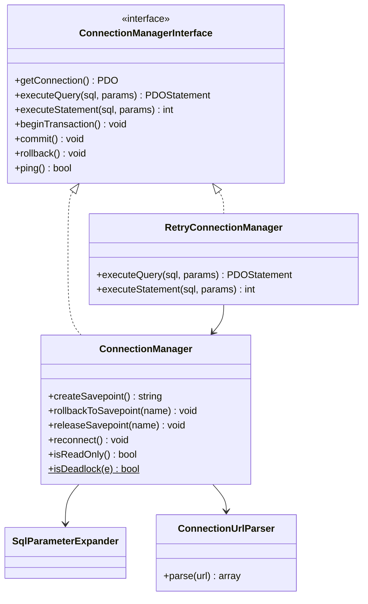
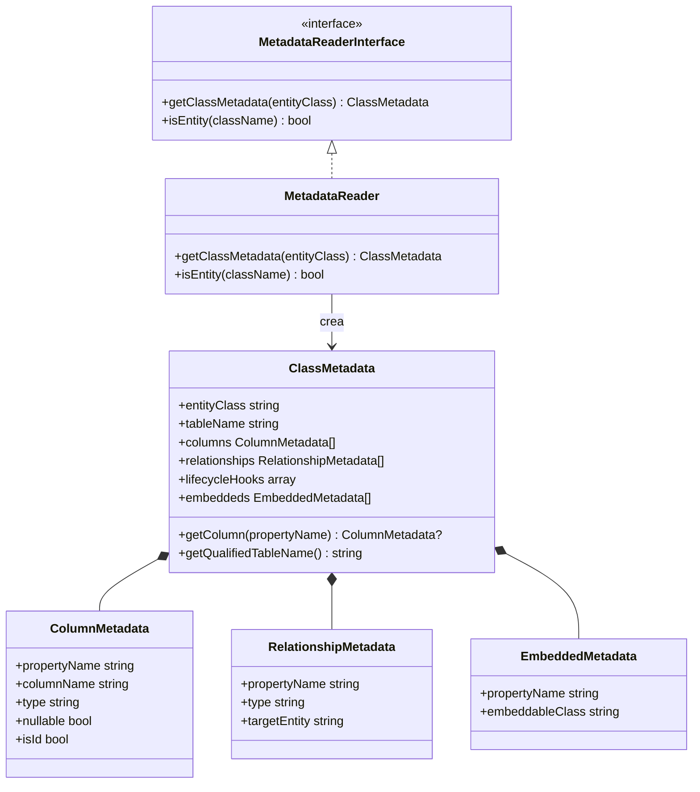
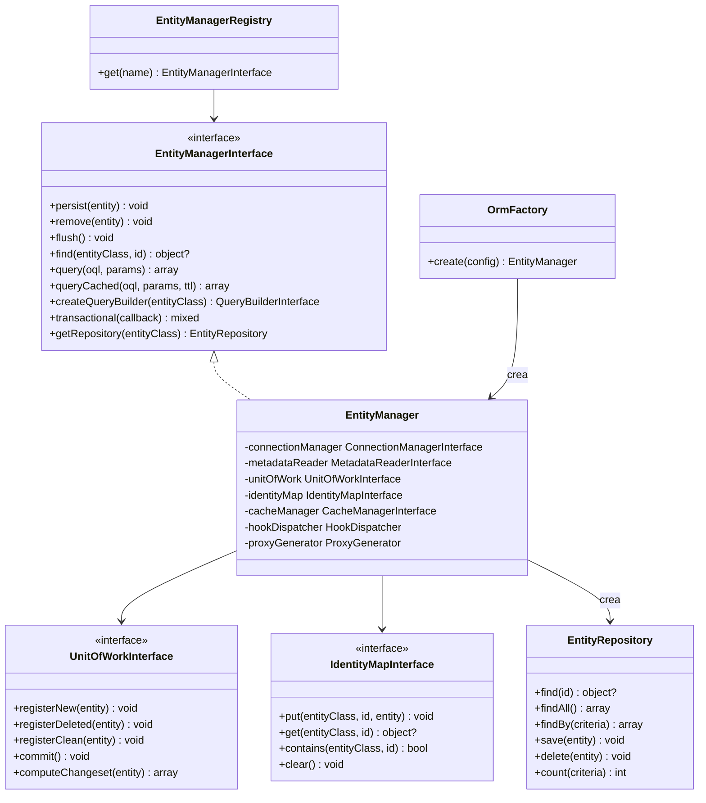
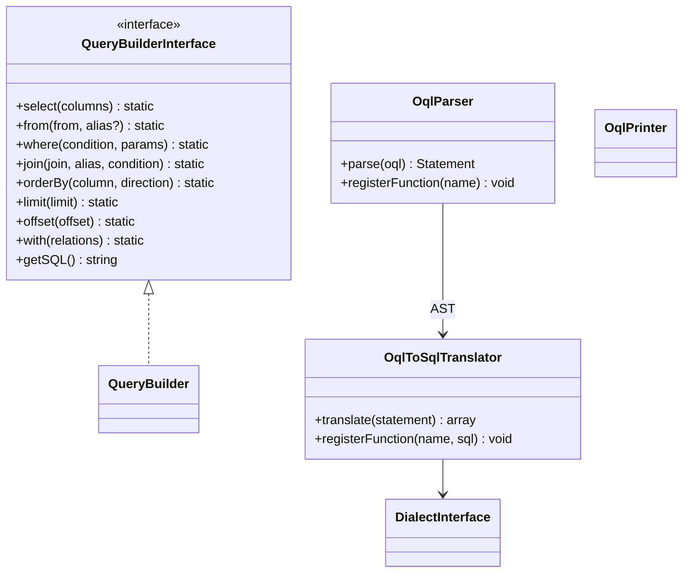
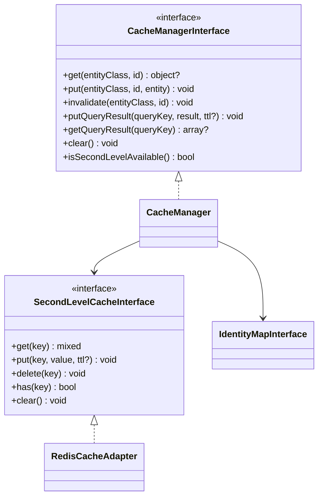
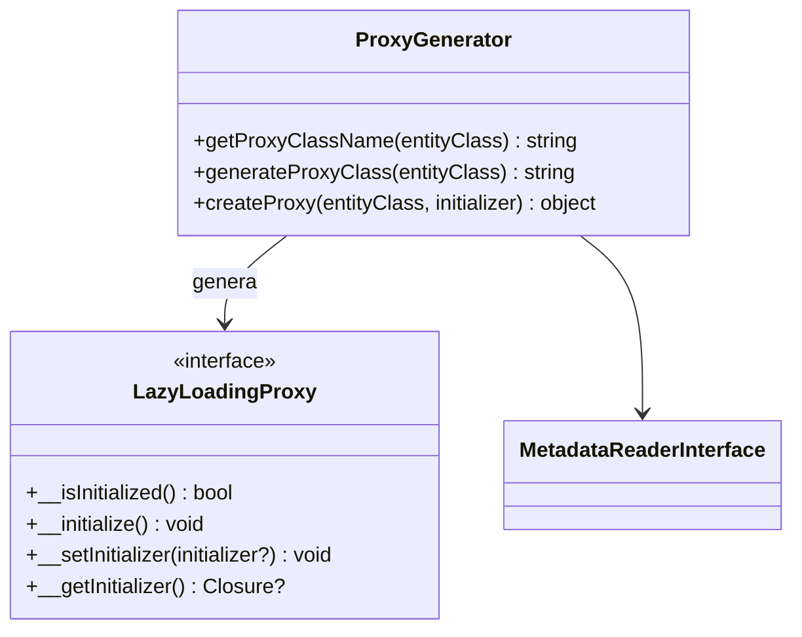
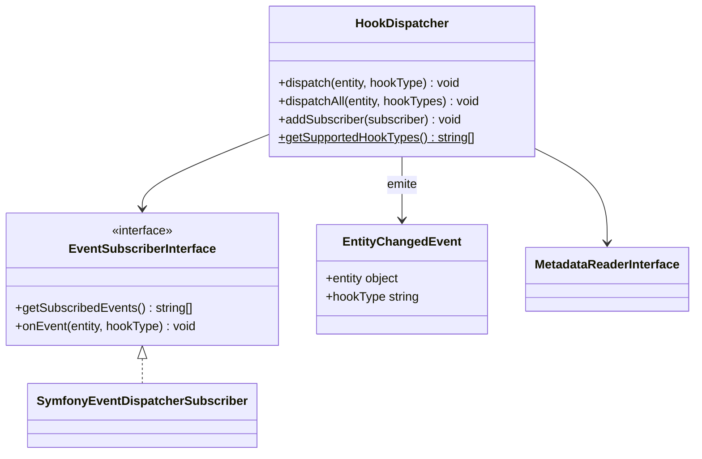
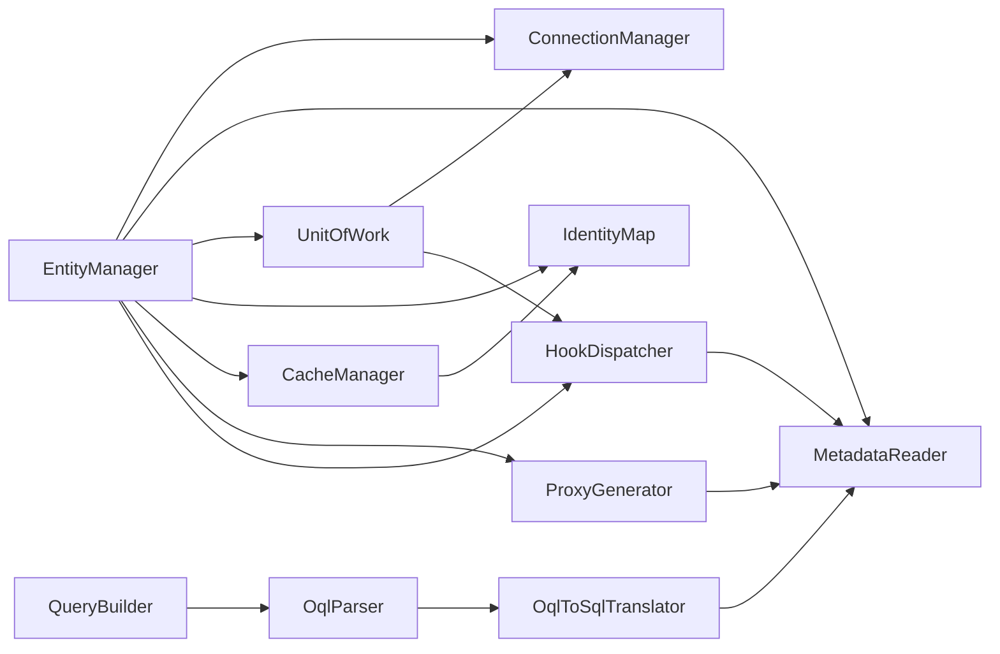

# Diagramas de Clases

Diagramas Mermaid de las clases principales por componente del ORM.
## Connection

## Metadata

## ORM

## Query

## Cache

## Proxy

## Hook

## Relaciones entre Componentes

---

← [Anterior](./flujo-hidratacion.md) | [Índice](./README.md) | [Siguiente →](./guias-contribucion.md)
