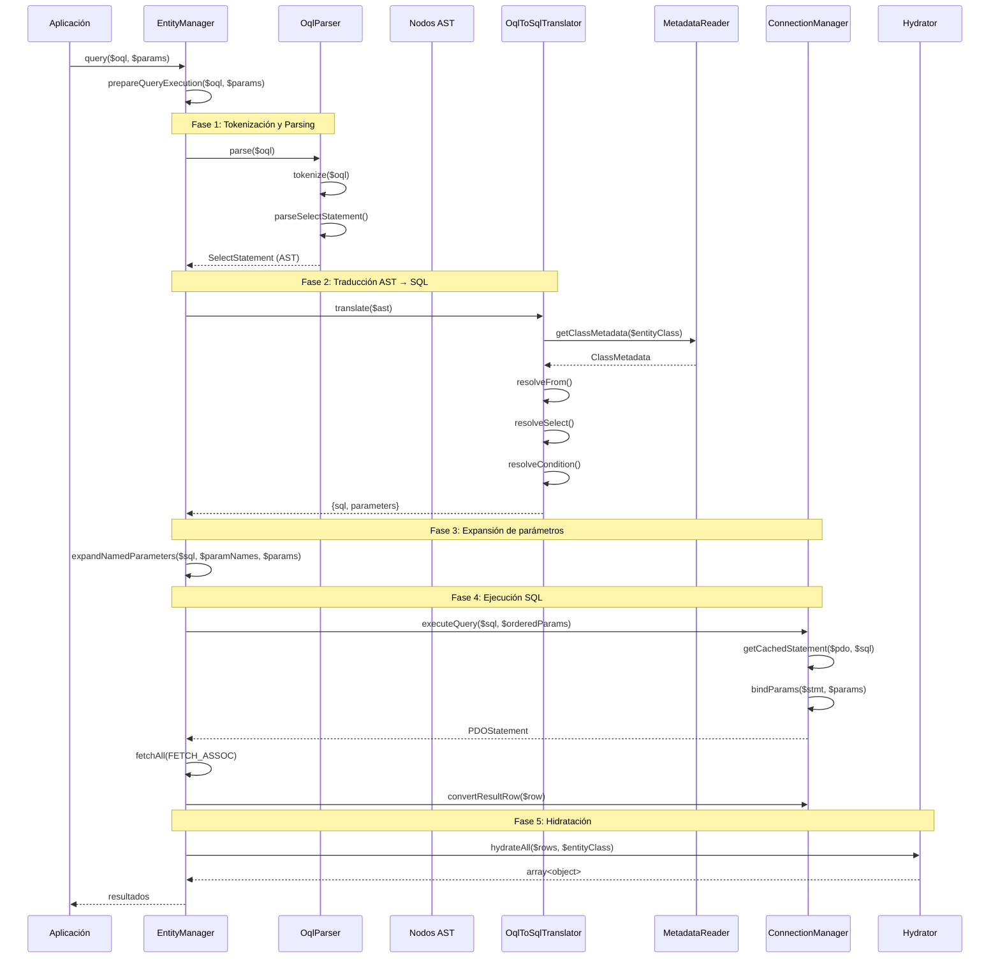
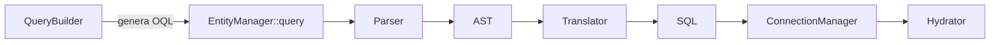

# Flujo de Consultas

Este documento describe el flujo interno desde que se escribe una consulta OQL o se usa el QueryBuilder hasta que se obtienen resultados hidratados como objetos PHP o arrays.

## Visión General

El sistema de consultas transforma OQL (Object Query Language) en SQL nativo de Sybase ASE a través de un pipeline de varias etapas: tokenización, parsing, generación de AST, traducción a SQL y ejecución con hidratación.

## Componentes del Pipeline

| Etapa | Componente | Responsabilidad |
|-------|-----------|----------------|
| 1. Entrada | `EntityManager::query()` | Punto de entrada, orquesta el flujo |
| 2. Tokenización | `OqlParser::tokenize()` | Divide el OQL en tokens |
| 3. Parsing | `OqlParser::parse()` | Construye el AST desde tokens |
| 4. AST | Nodos en `SybaseORM\Query\AST\` | Representación intermedia de la consulta |
| 5. Traducción | `OqlToSqlTranslator::translate()` | Convierte AST a SQL usando metadatos |
| 6. Parámetros | `EntityManager::expandNamedParameters()` | Mapea named params a positionales |
| 7. Ejecución | `ConnectionManager::executeQuery()` | Ejecuta SQL contra PDO |
| 8. Hidratación | `Hydrator::hydrateAll()` | Transforma filas en objetos PHP |

## Diagrama de Secuencia



## Detalle de Cada Fase

### Fase 1: Tokenización

El método `OqlParser::tokenize()` divide la cadena OQL en tokens individuales:

```
OQL: "SELECT e FROM Usuario e WHERE e.edad > :minEdad ORDER BY e.nombre"

Tokens: ['SELECT', 'e', 'FROM', 'Usuario', 'e', 'WHERE', 'e.edad', '>', ':minEdad', 'ORDER', 'BY', 'e.nombre']
```

Tipos de tokens reconocidos:
- **Palabras clave**: SELECT, FROM, WHERE, JOIN, ORDER, BY, GROUP, HAVING, AND, OR, IN, IS, NULL, NOT, LIKE, BETWEEN, ASC, DESC, DISTINCT
- **Identificadores**: nombres de entidades y propiedades (con notación punto: `e.nombre`)
- **Parámetros**: prefijo `:` seguido de alfanumérico (`:minEdad`)
- **Operadores**: `=`, `!=`, `<`, `>`, `<=`, `>=`
- **Literales**: cadenas entre comillas simples, números
- **Puntuación**: `,`, `(`, `)`, `*`

### Fase 2: Parsing → AST

El parser consume tokens secuencialmente y construye un árbol AST tipado:

```php
$ast = $this->oqlParser->parse($oql);
// Retorna: SelectStatement | UpdateStatement | DeleteStatement
```

**Nodos AST principales:**

| Nodo | Propiedades |
|------|------------|
| `SelectStatement` | selectExpressions, from, joins, where, orderBy, groupBy, havingClause, distinct |
| `FromClause` | entityName, alias |
| `JoinClause` | type, entityOrProperty, alias, condition |
| `Comparison` | left, operator, right |
| `LogicalExpression` | operator (AND/OR), left, right |
| `PropertyAccess` | alias, property |
| `Parameter` | name |
| `FunctionCall` | functionName, arguments |
| `CustomFunctionCall` | functionName, arguments |
| `OrderByClause` | items (OrderByItem[]) |
| `GroupByClause` | expressions |

### Fase 3: Traducción AST → SQL

El `OqlToSqlTranslator` recorre el AST y genera SQL usando los metadatos de las entidades:

```php
$result = $this->oqlTranslator->translate($ast);
// Retorna: ['sql' => string, 'parameters' => string[]]
```

**Resolución de nombres:**
- `Usuario` → nombre de tabla real (ej: `usuarios`)
- `e.nombre` → columna real (ej: `usuarios.nombre`)
- `e.direccion.calle` → columna embeddable (ej: `usuarios.direccion_calle`)

**Resolución de JOINs:**
- JOIN sobre propiedad de relación → se genera JOIN con FK real
- JOIN sobre entidad directa → se usa la condición ON especificada

**Funciones personalizadas:**
- `YEAR(e.fecha)` → `DATEPART(yy, tabla.fecha)` (según template registrado)

### Fase 4: Expansión de Parámetros

Los named parameters (`:nombre`) se convierten a positionales (`?`) en el orden que aparecen en el SQL:

```php
// Entrada
$sql = 'SELECT ... WHERE usuarios.edad > :minEdad AND usuarios.ciudad = :ciudad';
$params = ['minEdad' => 25, 'ciudad' => 'Santiago'];

// Salida
$sql = 'SELECT ... WHERE usuarios.edad > ? AND usuarios.ciudad = ?';
$orderedParams = [25, 'Santiago'];
```

Para parámetros de tipo array (cláusula IN), se expanden automáticamente:

```php
$params = ['ids' => [1, 2, 3]];
// :ids → ?, ?, ?
// $orderedParams = [1, 2, 3]
```

### Fase 5: Ejecución SQL

El `ConnectionManager` ejecuta la sentencia:

1. Busca un `PDOStatement` en caché LRU para el SQL
2. Si no existe, prepara la sentencia (`PDO::prepare()`)
3. Vincula parámetros con tipos PDO adecuados
4. Ejecuta y retorna el statement
5. Aplica conversión de charset (ISO-8859-1 → UTF-8) a cada fila

### Fase 6: Hidratación

Según el modo de hidratación:

| Modo | Comportamiento |
|------|---------------|
| `HYDRATE_OBJECT` | Filas → objetos PHP via `Hydrator::hydrateAll()` |
| `HYDRATE_ARRAY` | Retorna filas asociativas sin transformar |

La detección automática cambia a `HYDRATE_ARRAY` cuando:
- La consulta contiene funciones agregadas (COUNT, SUM, etc.)
- Hay GROUP BY presente
- Se seleccionan múltiples entidades

Ver [Flujo de Hidratación](./flujo-hidratacion.md) para el detalle completo.

## Caché de Consultas

El EntityManager mantiene un caché en memoria de traducciones OQL→SQL:

```php
if (isset($this->queryCache[$oql])) {
    $result = $this->queryCache[$oql];
} else {
    $result = $this->oqlTranslator->translate($ast);
    $this->queryCache[$oql] = $result;
}
```

Para la misma cadena OQL ejecutada múltiples veces con distintos parámetros, la traducción se reutiliza.

## QueryBuilder como Alternativa

El `QueryBuilder` construye OQL programáticamente y luego sigue el mismo pipeline:



```php
$qb = $em->createQueryBuilder(Usuario::class)
    ->where('e.edad > :minEdad')
    ->orderBy('e.nombre', 'ASC');

// Internamente genera: "SELECT e FROM Usuario e WHERE e.edad > :minEdad ORDER BY e.nombre ASC"
$resultados = $qb->getResult(['minEdad' => 25]);
```

## Variantes de Ejecución

| Método | Diferencia con `query()` |
|--------|--------------------------|
| `queryOne()` | Aplica LIMIT 1 via dialect, retorna un solo resultado |
| `queryScalar()` | LIMIT 1, retorna el primer valor de la primera columna |
| `queryIterator()` | No carga todo en memoria; usa Generator con fetch row-by-row |
| `queryCached()` | Verifica caché de segundo nivel (Redis) antes de ejecutar |
| `executeUpdate()` | Para UPDATE/DELETE OQL, retorna filas afectadas |

## Manejo de Errores

| Error | Excepción | Causa |
|-------|-----------|-------|
| Sintaxis OQL inválida | `OqlParseException` | Token inesperado durante parsing |
| Entidad no encontrada | `OqlParseException` | Nombre de entidad no registrado |
| Error de conexión | `ConnectionLostException` | Conexión a Sybase perdida |
| Deadlock | `PersistenceException` | Bloqueo detectado (verificable con `isDeadlock()`) |

---

← [Anterior](./flujo-persistencia.md) | [Índice](./README.md) | [Siguiente →](./flujo-hidratacion.md)
