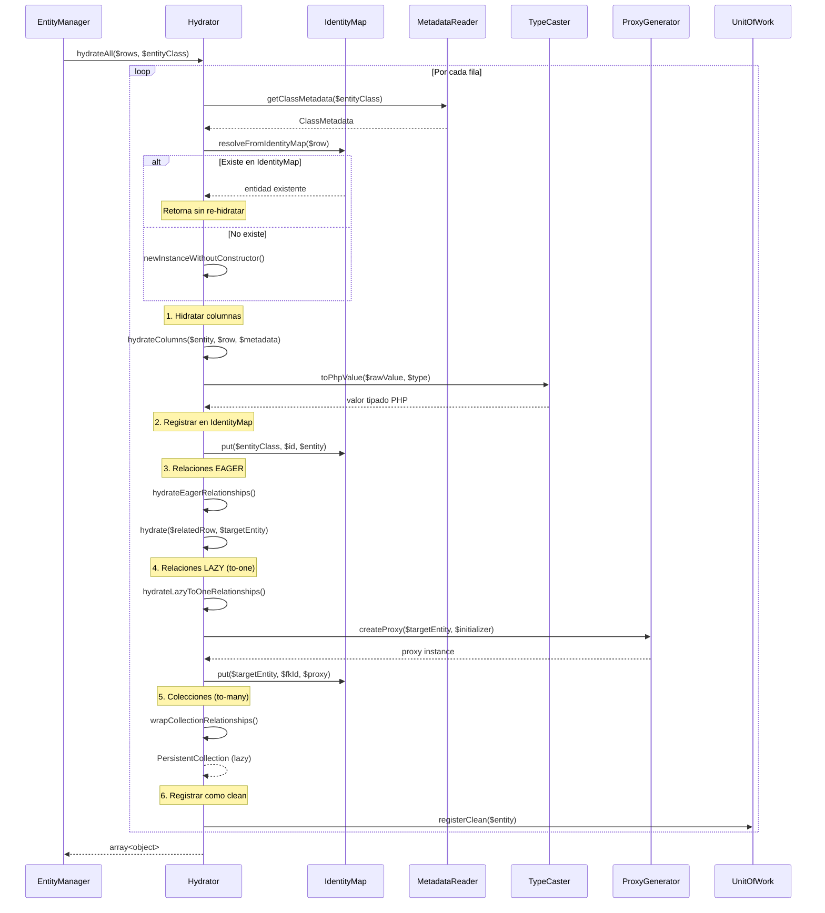
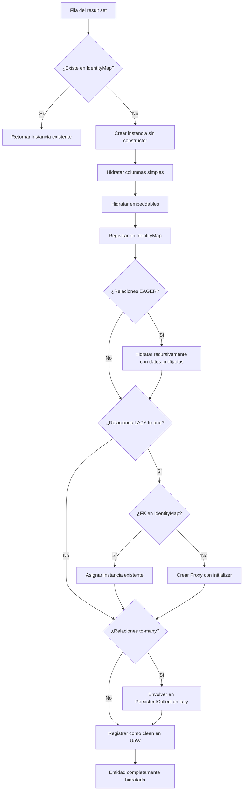

# Flujo de Hidratación

Este documento describe el proceso interno mediante el cual el ORM transforma un result set (filas de base de datos) en objetos PHP completamente inicializados, incluyendo el manejo de relaciones, embeddables y tipos personalizados.

## Visión General

La hidratación es el proceso de convertir filas asociativas (`array<string, mixed>`) provenientes de PDO en instancias de entidades PHP con sus propiedades correctamente tipadas, relaciones cargadas o proxy-ficadas, y objetos embeddable reconstituidos.

## Componentes Involucrados

| Componente | Clase | Responsabilidad |
|-----------|-------|----------------|
| Hydrator | `SybaseORM\Hydrator\Hydrator` | Orquesta el proceso completo de hidratación |
| MetadataReader | `SybaseORM\Metadata\MetadataReader` | Provee mapeo columnas ↔ propiedades |
| TypeCaster | `SybaseORM\Metadata\TypeCaster` | Convierte valores DB a tipos PHP |
| IdentityMap | `SybaseORM\ORM\IdentityMap` | Evita duplicados, resuelve referencias circulares |
| ProxyGenerator | `SybaseORM\Proxy\ProxyGenerator` | Crea proxies para lazy loading |
| UnitOfWork | `SybaseORM\ORM\UnitOfWork` | Registra entidades como "clean" |
| PersistentCollection | `SybaseORM\ORM\PersistentCollection` | Colecciones lazy para relaciones to-many |

## Diagrama del Proceso



## Fases del Proceso

### Fase 1: Verificación en Identity Map

Antes de crear una nueva instancia, el Hydrator verifica si la entidad ya existe en el IdentityMap:

```php
$existingEntity = $this->resolveFromIdentityMap($row, $metadata);
if ($existingEntity !== null) {
    return $existingEntity; // Misma instancia, sin duplicados
}
```

Esto garantiza:
- **Identidad de objeto**: la misma fila siempre retorna la misma instancia PHP
- **Referencias circulares**: se resuelven sin recursión infinita
- **Consistencia**: modificaciones previas al objeto se preservan

Si encuentra un `LazyLoadingProxy` no inicializado, lo reutiliza y lo hidrata en lugar de crear una nueva instancia.

### Fase 2: Creación de Instancia

Se crea la entidad sin invocar el constructor:

```php
$reflectionClass = $this->getReflectionClass($entityClass);
$entity = $reflectionClass->newInstanceWithoutConstructor();
```

Esto evita efectos secundarios del constructor y permite hidratar propiedades sin restricciones de firma.

### Fase 3: Hidratación de Columnas

Para cada columna del result set que tiene mapeo en los metadatos:

```php
foreach ($row as $columnName => $rawValue) {
    $column = $metadata->getColumnByName($columnName);
    $phpValue = $this->typeCaster->toPhpValue($rawValue, $column->type);
    $this->setPropertyValue($entity, $column->propertyName, $phpValue);
}
```

**Conversión de tipos** (`TypeCaster::toPhpValue()`):

| Tipo DB | Tipo PHP | Ejemplo |
|---------|----------|---------|
| `integer` | `int` | `'42'` → `42` |
| `string` | `string` | sin conversión |
| `boolean` | `bool` | `'1'` → `true` |
| `datetime` | `\DateTimeImmutable` | `'2024-01-15 10:30:00'` → objeto |
| `float` | `float` | `'3.14'` → `3.14` |
| `decimal` | `string` | se preserva precisión |
| BackedEnum | enum instance | `'active'` → `Status::Active` |
| CustomType | según implementación | delega a `CustomTypeInterface::toPhpValue()` |

### Fase 4: Hidratación de Embeddables

Los embeddables se almacenan como columnas prefijadas en la tabla. El Hydrator los reconstruye como objetos:

```
Columnas DB: direccion_calle, direccion_ciudad, direccion_codigo_postal
                              ↓
Metadatos: propertyName = "direccion.calle", "direccion.ciudad", "direccion.codigoPostal"
                              ↓
Resultado: $entity->direccion = new Direccion(calle, ciudad, codigoPostal)
```

Proceso:
1. Se agrupan valores por prefijo del embeddable (`direccion.X` → grupo `direccion`)
2. Si todos los valores son `null`, no se crea el objeto (relación nullable)
3. Se instancia la clase embeddable sin constructor
4. Se asignan las propiedades internas

### Fase 5: Registro en Identity Map (temprano)

Inmediatamente después de hidratar columnas, se registra en el IdentityMap:

```php
$this->storeInIdentityMap($entity, $metadata, $reflectionClass);
```

Esto es **crítico** para resolver referencias circulares: si una relación eager apunta de vuelta a esta entidad, la llamada recursiva a `hydrate()` encontrará la instancia en el mapa en vez de crear una nueva.

### Fase 6: Relaciones EAGER

Para relaciones marcadas con `fetch='EAGER'`, los datos vienen en la misma fila con prefijo:

```
Fila: {id: 1, nombre: 'Juan', perfil.id: 5, perfil.bio: 'Dev'}
                                   ↓
$relatedRow = ['id' => 5, 'bio' => 'Dev']
$relatedEntity = $this->hydrate($relatedRow, Perfil::class)
```

Si todos los valores prefijados son `null` (LEFT JOIN sin match), la relación queda como `null`.

### Fase 7: Relaciones LAZY (to-one)

Para `ManyToOne` y `OneToOne` con `fetch='LAZY'`:

1. Se extraen los valores de FK de la fila actual
2. Se verifica si el objeto destino ya existe en el IdentityMap
3. Si no existe, se crea un **Proxy** con un initializer:

```php
$initializer = function (object $proxy) use ($em, $relationship, $proxyId): void {
    $real = $em->find($relationship->targetEntity, $proxyId);
    // Copia propiedades del objeto real al proxy
};

$proxy = $this->proxyGenerator->createProxy($targetEntity, $initializer);
```

El proxy se registra en el IdentityMap con el ID de la FK. Cuando se accede a cualquier propiedad del proxy (excepto el ID), se dispara el initializer que carga el objeto real desde la BD.

### Fase 8: Colecciones LAZY (to-many)

Para relaciones `OneToMany` y `ManyToMany`:

```php
$collection = new PersistentCollection(
    function () use ($loader, $ownerClass, $relPropName, $ownerEntity): array {
        return ($loader)($ownerClass, $relPropName, $ownerEntity);
    }
);
```

La `PersistentCollection` es lazy: solo ejecuta la consulta cuando se itera o se accede a sus elementos. El loader invoca al EntityManager para cargar las entidades relacionadas.

### Fase 9: Registro como Clean

Finalmente, se registra la entidad en el UnitOfWork como "clean":

```php
$this->unitOfWork->registerClean($entity);
```

Esto toma un snapshot del estado actual. Si después se modifican propiedades, `computeChangeset()` detectará las diferencias al hacer `flush()`.

## Diagrama de Decisiones



## Casos Especiales

### Herencia Single-Table

Cuando una entidad usa `#[InheritanceType]`, el Hydrator:
1. Lee la columna discriminadora de la fila
2. Resuelve la clase concreta desde el `#[DiscriminatorMap]`
3. Hidrata usando los metadatos de la clase concreta (puede tener columnas adicionales)

### Tipos Personalizados

Para columnas con `CustomTypeInterface` registrado:

```php
$phpValue = $this->typeCaster->toPhpValue($rawValue, $column->type);
// Internamente: $customType->toPhpValue($rawValue)
```

El TypeCaster detecta si el tipo tiene una implementación personalizada y delega la conversión.

### hydrateAll() vs hydrate()

| Método | Uso |
|--------|-----|
| `hydrate($row, $class)` | Hidrata una sola fila en una entidad |
| `hydrateAll($rows, $class)` | Itera sobre múltiples filas, invoca `hydrate()` por cada una |

`hydrateAll()` es simplemente un loop que acumula resultados:

```php
public function hydrateAll(array $rows, string $entityClass): array
{
    return array_map(fn($row) => $this->hydrate($row, $entityClass), $rows);
}
```

## Rendimiento

- **IdentityMap**: evita re-hidratación de entidades ya cargadas
- **Proxy lazy loading**: difiere consultas de relaciones hasta que se necesitan
- **PersistentCollection**: las colecciones no cargan hasta iteración
- **Sin constructor**: `newInstanceWithoutConstructor()` evita lógica innecesaria
- **Caché de ReflectionClass**: se reutilizan objetos de reflexión entre hidrataciones

---

← [Anterior](./flujo-consultas.md) | [Índice](./README.md) | [Siguiente →](./diagramas-clases.md)
