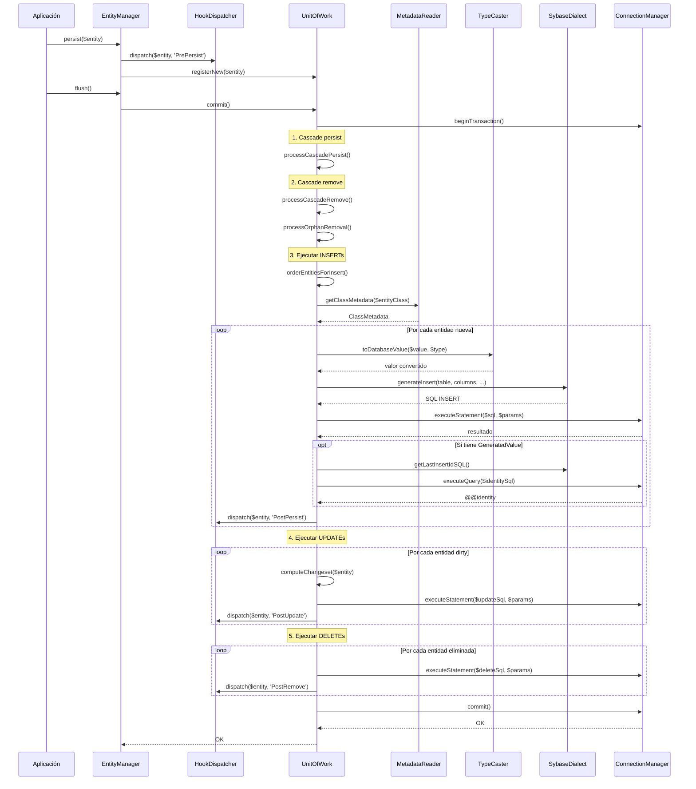

# Flujo de Persistencia

Este documento describe el flujo interno completo desde que se invoca `EntityManager::persist()` hasta que el SQL INSERT/UPDATE/DELETE se ejecuta contra la base de datos Sybase ASE.

## Visión General

La persistencia en el ORM sigue un patrón de escritura diferida (Unit of Work). Las entidades no se persisten inmediatamente al llamar `persist()`, sino que se registran para escritura y el SQL se ejecuta al invocar `flush()`.

## Componentes Involucrados

| Componente | Clase | Responsabilidad |
|-----------|-------|----------------|
| EntityManager | `SybaseORM\ORM\EntityManager` | Punto de entrada del usuario. Delega a UnitOfWork y HookDispatcher |
| HookDispatcher | `SybaseORM\Hook\HookDispatcher` | Dispara lifecycle hooks (PrePersist, PostPersist, etc.) |
| UnitOfWork | `SybaseORM\ORM\UnitOfWork` | Gestiona changeset, ordena operaciones, genera SQL |
| MetadataReader | `SybaseORM\Metadata\MetadataReader` | Provee metadatos de columnas, relaciones y tabla |
| TypeCaster | `SybaseORM\Metadata\TypeCaster` | Convierte valores PHP a tipos de base de datos |
| Dialect | `SybaseORM\Dialect\SybaseDialect` | Genera SQL específico de Sybase ASE |
| ConnectionManager | `SybaseORM\Connection\ConnectionManager` | Ejecuta sentencias SQL contra PDO |
| IdentityMap | `SybaseORM\ORM\IdentityMap` | Registra entidades gestionadas por identidad |

## Diagrama de Secuencia



## Detalle del Flujo

### Fase 1: persist()

```php
public function persist(object $entity): void
{
    $this->hookDispatcher->dispatch($entity, 'PrePersist');
    $this->unitOfWork->registerNew($entity);
}
```

El EntityManager:
1. Dispara el hook `PrePersist` (permite modificar la entidad antes de registrarla)
2. Registra la entidad en el UnitOfWork como "nueva" (`SplObjectStorage`)

En este punto NO se ejecuta SQL. La entidad queda en cola.

### Fase 2: flush() → commit()

`flush()` delega en `UnitOfWork::commit()`, que ejecuta todo dentro de una transacción:

```php
public function flush(): void
{
    $this->unitOfWork->commit();
}
```

### Fase 3: Cascade y Ordenamiento

Dentro de `commit()`:

1. **processCascadePersist()** — Descubre entidades relacionadas con `cascade=['persist']` y las registra automáticamente
2. **processCascadeRemove()** — Propaga eliminaciones en cascada
3. **processOrphanRemoval()** — Detecta elementos removidos de colecciones con `orphanRemoval=true`
4. **orderEntitiesForInsert()** — Ordena las inserciones respetando dependencias de claves foráneas

### Fase 4: Ejecución de INSERTs

Para cada entidad nueva (ordenada por dependencias FK):

1. Se obtiene `ClassMetadata` del `MetadataReader` (mapeo columnas ↔ propiedades)
2. Se itera sobre las columnas mapeadas extrayendo valores con `TypeCaster::toDatabaseValue()`
3. Se genera el SQL INSERT con `SybaseDialect::generateInsert()` (maneja identity columns)
4. Se ejecuta via `ConnectionManager::executeStatement()`
5. Si tiene `#[GeneratedValue]`, se recupera `@@identity` y se asigna al objeto
6. Se propaga el ID generado a entidades dependientes (FK)
7. Se registra como "clean" en el IdentityMap
8. Se dispara `PostPersist`

### Fase 5: Ejecución de UPDATEs

Para cada entidad gestionada (pre-existente):

1. Se compara el estado actual con el snapshot original (`computeChangeset()`)
2. Si hay diferencias (dirty), se genera UPDATE solo con columnas modificadas
3. Se ejecuta el SQL y se dispara `PostUpdate`

### Fase 6: Ejecución de DELETEs

Para entidades marcadas con `remove()`:

1. Se construye la cláusula WHERE con la PK (soporte para PKs compuestas)
2. Se ejecuta DELETE (o UPDATE del campo soft-delete si aplica)
3. Se dispara `PostRemove`

## Manejo de Errores

Si cualquier operación falla durante `commit()`:

```php
} catch (\Throwable $e) {
    $this->safeRollback();
    throw new PersistenceException('Flush failed: ' . $e->getMessage(), ...);
}
```

- Se ejecuta `safeRollback()` para revertir la transacción
- Se lanza `PersistenceException` envolviendo el error original
- Las entidades permanecen en su estado previo al flush

## Conversión de Tipos

El `TypeCaster` interviene en dos momentos:

| Dirección | Método | Uso |
|-----------|--------|-----|
| PHP → DB | `toDatabaseValue($value, $type)` | Al generar INSERT/UPDATE |
| DB → PHP | `toPhpValue($value, $type)` | Al recuperar `@@identity` |

Para tipos personalizados (`CustomTypeInterface`), el TypeCaster delega en la implementación registrada.

## Sentencias Preparadas y Caché

El `ConnectionManager` mantiene un caché LRU de sentencias preparadas (`getCachedStatement()`). Si el mismo SQL INSERT se ejecuta múltiples veces (batch de entidades del mismo tipo), se reutiliza el `PDOStatement` compilado.

---

← [Anterior](./extension-funciones-oql.md) | [Índice](./README.md) | [Siguiente →](./flujo-consultas.md)
