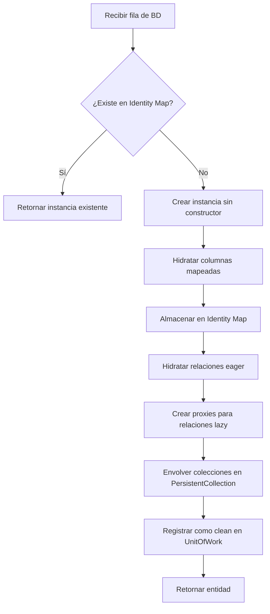

# Patrón Data Mapper

El patrón Data Mapper establece una separación estricta entre los objetos de dominio (entidades) y la capa de persistencia (base de datos). En `shedeza/sybase-orm`, las entidades no conocen cómo se almacenan ni cómo se recuperan; esa responsabilidad recae en el **Hydrator**, que actúa como el componente central del mapping entre filas de base de datos y objetos PHP.

## Principio de Separación

En un ORM basado en Data Mapper, las entidades son objetos PHP puros (POPOs) que:

- No extienden ninguna clase base del ORM
- No implementan interfaces de persistencia
- Definen propiedades privadas con atributos declarativos (`#[Entity]`, `#[Column]`)
- Desconocen completamente la existencia de la base de datos

La traducción entre el mundo relacional y el mundo de objetos se realiza externamente, a través del Hydrator y los metadatos de mapeo.

```
┌─────────────────────┐         ┌──────────────────────┐
│   Capa de Dominio   │         │ Capa de Persistencia │
│                     │         │                      │
│  Entidades (POPOs)  │◄───────►│  Hydrator + Metadata │
│  - User             │  mapeo  │  - MetadataReader    │
│  - Order            │         │  - TypeCaster        │
│  - Product          │         │  - ConnectionManager │
└─────────────────────┘         └──────────────────────┘
```

## Interfaz del Hydrator

El contrato del Hydrator se define en `HydratorInterface`:

```php
namespace SybaseORM\Hydrator;

interface HydratorInterface
{
    /**
     * Hidrata una fila de base de datos en una instancia de entidad.
     * Usa Reflection API para asignar valores a propiedades privadas.
     * Consulta el Identity Map antes de crear una nueva instancia.
     * Ignora columnas no mapeadas sin lanzar error.
     */
    public function hydrate(array $row, string $entityClass): object;

    /**
     * Hidrata múltiples filas en un array de instancias de entidad.
     *
     * @return object[]
     */
    public function hydrateAll(array $rows, string $entityClass): array;
}
```

La interfaz es mínima y expresiva: recibe datos crudos (arrays asociativos de PDO) y devuelve objetos de dominio completamente poblados.

## Implementación: Clase Hydrator

La clase `Hydrator` implementa `HydratorInterface` y coordina múltiples subsistemas:

```php
namespace SybaseORM\Hydrator;

final class Hydrator implements HydratorInterface
{
    public function __construct(
        private readonly MetadataReaderInterface $metadataReader,
        private readonly TypeCasterInterface $typeCaster,
        private readonly ?IdentityMapInterface $identityMap = null,
        private readonly ?UnitOfWorkInterface $unitOfWork = null,
        private readonly ?ProxyGenerator $proxyGenerator = null,
        private ?EntityManagerInterface $entityManager = null,
    ) {}
}
```

### Dependencias y Colaboradores

| Colaborador | Rol en la hidratación |
|-------------|----------------------|
| `MetadataReaderInterface` | Proporciona el mapeo columna → propiedad para cada entidad |
| `TypeCasterInterface` | Convierte valores de la BD a tipos PHP (int, DateTime, enum, etc.) |
| `IdentityMapInterface` | Garantiza unicidad de instancias por identidad (evita duplicados) |
| `UnitOfWorkInterface` | Registra entidades como "clean" para dirty checking posterior |
| `ProxyGenerator` | Crea proxies para lazy loading de relaciones to-one |
| `EntityManagerInterface` | Permite al Hydrator resolver relaciones inversas |

## Flujo de Hidratación

El método `hydrate()` ejecuta una secuencia ordenada de pasos:



### 1. Consulta al Identity Map

Antes de crear una nueva instancia, el Hydrator verifica si ya existe una entidad con la misma identidad. Esto garantiza que una misma fila de BD siempre mapea al mismo objeto PHP dentro de una sesión:

```php
$existingEntity = $this->identityMap->get($metadata->entityClass, $idValue);
if ($existingEntity !== null) {
    return $existingEntity;
}
```

### 2. Creación sin Constructor

Las entidades se instancian con `ReflectionClass::newInstanceWithoutConstructor()`. Esto permite que el constructor de la entidad defina su propia lógica de inicialización sin interferir con la hidratación desde BD.

### 3. Hidratación de Columnas

Para cada columna mapeada en los metadatos, el Hydrator:

1. Busca el valor en la fila por nombre de columna
2. Aplica conversión de tipo vía `TypeCaster::toPhpValue()`
3. Asigna el valor a la propiedad vía Reflection (incluso si es privada)

Las propiedades embebidas (value objects) se detectan por notación de punto en el nombre de propiedad (ej: `address.street`) y se hidratan como objetos independientes.

### 4. Relaciones Eager

Las relaciones marcadas como `EAGER` se hidratan recursivamente. Los datos relacionados llegan en la fila con prefijo (`profile.id`, `profile.name`) y se pasan a una llamada recursiva a `hydrate()`.

### 5. Relaciones Lazy (Proxies)

Las relaciones `ManyToOne` y `OneToOne` marcadas como `LAZY` se resuelven mediante proxies:

- Se extraen los valores de FK de la fila
- Se verifica el Identity Map (evita proxy si ya existe la entidad)
- Se crea un `LazyLoadingProxy` con un initializer que cargará la entidad real al primer acceso

### 6. Colecciones (to-many)

Las relaciones `OneToMany` y `ManyToMany` se envuelven en `PersistentCollection` con un loader que permite carga lazy del conjunto completo de entidades relacionadas.

## Conversión de Tipos

El `TypeCaster` es esencial para el Data Mapper: transforma valores crudos de PDO a tipos PHP ricos:

| Tipo DB | Tipo PHP |
|---------|----------|
| `integer` | `int` |
| `string`, `text` | `string` |
| `datetime` | `DateTime` o `DateTimeImmutable` |
| `boolean` | `bool` |
| `float`, `real` | `float` |
| `decimal`, `numeric` | `string` (precisión exacta) |
| BackedEnum | Instancia del enum correspondiente |

El Hydrator además detecta el tipo declarado en la propiedad para realizar conversiones inteligentes entre `DateTime` y `DateTimeImmutable`.

## Caché de Reflection

Para evitar la penalización de rendimiento de la Reflection API, el Hydrator mantiene cachés internas:

```php
/** @var array<string, ReflectionClass<object>> */
private array $reflectionClassCache = [];

/** @var array<string, array<string, ReflectionProperty>> */
private array $reflectionPropertyCache = [];
```

Esto garantiza que una `ReflectionClass` o `ReflectionProperty` se crea una sola vez por sesión, independientemente de cuántas entidades del mismo tipo se hidraten.

## Integración con el Identity Map

El almacenamiento en el Identity Map ocurre **inmediatamente después** de hidratar las columnas, antes de resolver relaciones. Este orden es crítico para manejar referencias circulares:

```
User ──has──► Profile ──belongsTo──► User (mismo objeto)
```

Si el User se almacena en el Map antes de hidratar la relación con Profile, cuando Profile intente resolver su relación `belongsTo User`, encontrará la instancia ya existente en lugar de crear un ciclo infinito.

## Registro en UnitOfWork

Al finalizar la hidratación, la entidad se registra como "clean" en el Unit of Work:

```php
$this->unitOfWork->registerClean($entity);
```

Esto establece el snapshot inicial del estado de la entidad. Cualquier modificación posterior será detectada por dirty checking durante el `flush()`.

## Ventajas del Patrón

1. **Entidades limpias**: los objetos de dominio no tienen dependencias del ORM
2. **Testabilidad**: las entidades se pueden instanciar y probar sin base de datos
3. **Flexibilidad**: el mapeo se define declarativamente y puede evolucionar
4. **Rendimiento**: la caché de Reflection y el Identity Map minimizan overhead
5. **Consistencia**: una fila = un objeto dentro de una sesión

---

← [Anterior](./patron-identity-map.md) | [Índice](./README.md) | [Siguiente →](./patron-proxy.md)
