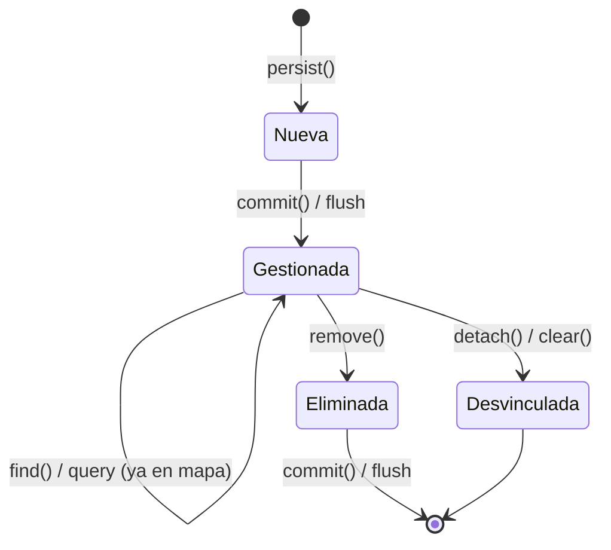
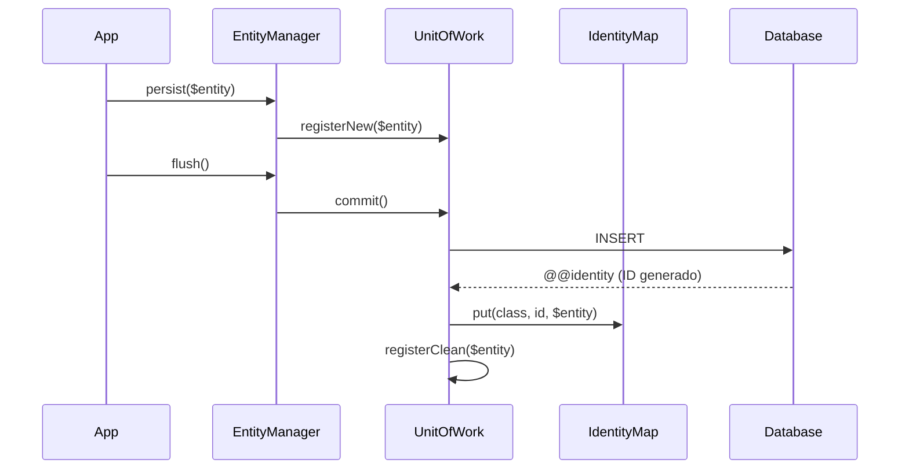

# Patrón Identity Map

El patrón Identity Map garantiza que dentro de una sesión de trabajo (una instancia de `EntityManager`) solo exista **una única instancia PHP** por cada entidad identificada por su clase y su clave primaria. Esto evita inconsistencias de datos en memoria y optimiza el rendimiento al funcionar como caché de primer nivel.

## Propósito

| Problema | Solución Identity Map |
|----------|----------------------|
| Múltiples consultas devuelven la misma fila | Se retorna siempre la misma instancia PHP |
| Modificaciones en dos variables apuntan a datos distintos | Una sola instancia garantiza coherencia |
| Consultas repetidas al mismo registro | Lectura directa desde memoria (caché L1) |

## Interfaz pública

La interfaz `IdentityMapInterface` define el contrato:

```php
namespace SybaseORM\ORM;

interface IdentityMapInterface
{
    public function put(string $entityClass, mixed $id, object $entity): void;
    public function get(string $entityClass, mixed $id): ?object;
    public function contains(string $entityClass, mixed $id): bool;
    public function remove(string $entityClass, mixed $id): void;
    public function clear(): void;
    public function clearClass(string $entityClass): void;
    public function count(): int;
    public function countClass(string $entityClass): int;
}
```

## Estructura interna

La implementación `IdentityMap` utiliza un array anidado bidimensional:

```
$map[className][derivedKey] = entity
```

Donde `derivedKey` es una representación de cadena determinista del identificador, con prefijos de tipo para evitar colisiones (por ejemplo, el entero `1` no colisiona con la cadena `'1'`).

### Derivación de claves

```php
// Escalar: prefijo de tipo + valor
IdentityMap::deriveKey(1);       // "i:1"
IdentityMap::deriveKey('abc');   // "s:abc"
IdentityMap::deriveKey(true);   // "b:1"

// Compuesto (claves primarias multi-columna): ksort + implode con pipe
IdentityMap::deriveKey(['col_a' => 1, 'col_b' => 'x']);  // "i:1|s:x"
```

Los prefijos de tipo son:

| Prefijo | Tipo PHP |
|---------|----------|
| `i:` | int |
| `s:` | string |
| `f:` | float |
| `b:` | bool |
| `n:` | null |

## Ciclo de vida de una entidad gestionada



### 1. Registro en el mapa (put)

Cuando una entidad se persiste por primera vez o se carga desde la base de datos, el `EntityManager` la registra en el Identity Map:

```php
$this->identityMap->put($entityClass, $generatedId, $entity);
```

**Regla de precedencia de proxies:** si ya existe una entidad real en el mapa y se intenta registrar un `LazyLoadingProxy` con el mismo identificador, la operación se ignora. La entidad real siempre tiene precedencia sobre un proxy.

### 2. Consulta desde el mapa (get)

Antes de consultar la base de datos, `EntityManager::find()` verifica el mapa:

```php
$entity = $this->identityMap->get($entityClass, $id);
if ($entity !== null) {
    return $entity; // Sin consulta SQL
}
```

Esto convierte al Identity Map en la **caché de primer nivel** del ORM.

### 3. Verificación de existencia (contains)

Permite determinar si una entidad ya está gestionada sin recuperarla:

```php
if ($this->identityMap->contains(User::class, $userId)) {
    // La entidad ya está en memoria
}
```

### 4. Eliminación del mapa (remove)

Cuando una entidad se elimina (DELETE o soft-delete), el `UnitOfWork` la remueve del mapa:

```php
$this->identityMap->remove($entity::class, $idValue);
```

También se invoca durante `detach()` para desvincular una entidad de la sesión.

## Interacción con Unit of Work

El Identity Map y el Unit of Work trabajan en conjunto para gestionar el ciclo de vida completo:

| Operación | Identity Map | Unit of Work |
|-----------|-------------|--------------|
| `persist()` | — | Registra como nueva |
| `commit()` (INSERT) | `put()` con ID generado | Toma snapshot, marca como limpia |
| `find()` | `get()` → retorna si existe | — |
| Carga desde DB | `put()` | `registerClean()` → snapshot |
| `remove()` | — | Registra como eliminada |
| `commit()` (DELETE) | `remove()` | Elimina snapshot |
| `detach()` | `remove()` | Elimina de todos los storages |
| `clear()` | `clear()` | Limpia todos los storages |

### Flujo de commit con Identity Map



## Limpieza del mapa

### clear() — Limpieza total

Resetea completamente el Identity Map y el Unit of Work. Todas las entidades quedan desvinculadas:

```php
$em->clear();
// Equivale a:
// $identityMap->clear()
// $unitOfWork->clear()
```

**Caso de uso:** procesamiento batch donde se procesan miles de registros y se necesita liberar memoria periódicamente.

```php
$batchSize = 100;
foreach ($registros as $i => $data) {
    $entity = new Producto($data);
    $em->persist($entity);

    if (($i + 1) % $batchSize === 0) {
        $em->flush();
        $em->clear(); // Libera memoria
    }
}
```

### clearClass() — Limpieza selectiva

Limpia solo las entidades de una clase específica, manteniendo las demás intactas:

```php
$em->clear(Producto::class);
// Solo Producto se desvincula; otras entidades siguen gestionadas
```

Internamente:

```php
// IdentityMap
public function clearClass(string $entityClass): void
{
    unset($this->map[$entityClass]);
}
```

## Conteo de entidades

Para diagnóstico y monitoreo del consumo de memoria:

```php
// Total de entidades en el mapa
$total = $identityMap->count();

// Entidades de una clase específica
$usuarios = $identityMap->countClass(User::class);
```

## Consideraciones de rendimiento

1. **Memoria:** El Identity Map crece con cada entidad cargada. En procesamiento batch, usar `clear()` periódicamente.
2. **Sin expiración:** A diferencia de una caché tradicional, las entradas no expiran automáticamente. Persisten durante toda la vida del `EntityManager`.
3. **Claves compuestas:** El soporte para claves primarias multi-columna añade una normalización mínima (ksort + implode) que es O(k) donde k es el número de columnas del PK.
4. **Proxies:** La regla de precedencia evita que un proxy sobrescriba datos ya hidratados, manteniendo la integridad sin consultas adicionales.

## Relación con otros componentes

```
EntityManager
├── IdentityMap ← Caché L1, unicidad de instancias
├── UnitOfWork  ← Tracking de cambios, snapshots
├── Hydrator    ← Registra entidades hidratadas en el mapa
└── CacheManager ← Caché L2 (Redis), consultada si L1 falla
```

El Identity Map es consultado **antes** que la caché de segundo nivel y **antes** que la base de datos, formando la primera capa del sistema de caché multinivel del ORM.

---

← [Anterior](./patron-unit-of-work.md) | [Índice](./README.md) | [Siguiente →](./patron-data-mapper.md)
