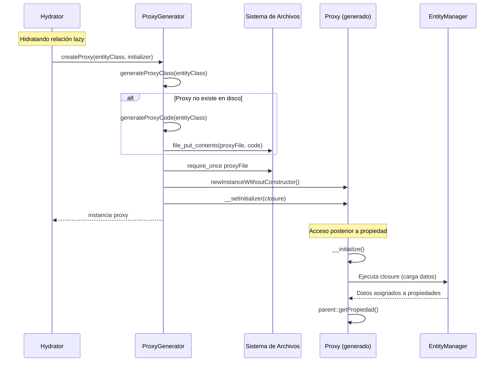
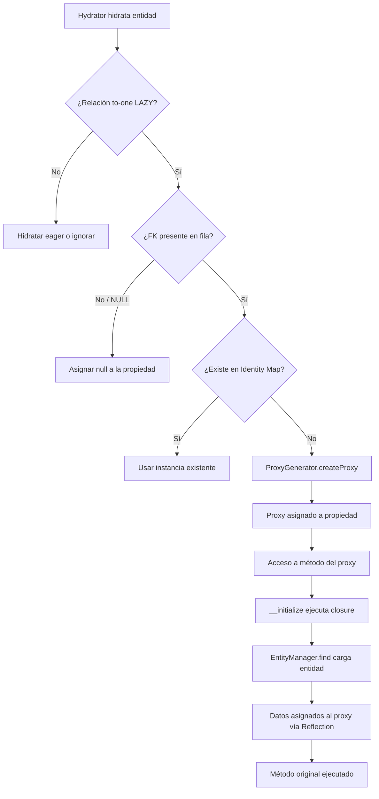

# Patrón Proxy (Lazy Loading)

El patrón Proxy en `shedeza/sybase-orm` permite diferir la carga de entidades relacionadas hasta el momento en que realmente se accede a sus datos. Esto evita consultas innecesarias a la base de datos cuando se hidratan relaciones `ManyToOne` y `OneToOne` que pueden no ser utilizadas durante la ejecución.

## Componentes del Sistema de Proxies

El sistema se compone de tres elementos:

| Componente | Archivo | Responsabilidad |
|------------|---------|-----------------|
| `LazyLoadingProxy` | `src/Proxy/LazyLoadingProxy.php` | Interfaz que todo proxy generado implementa |
| `ProxyGenerator` | `src/Proxy/ProxyGenerator.php` | Genera clases proxy dinámicamente y las almacena en disco |
| Directorio de proxies | Configurable vía `proxy_directory` | Almacena los archivos PHP generados (caché en disco) |

## Diagrama de Generación y Uso



## Interfaz LazyLoadingProxy

Todos los proxies generados implementan esta interfaz, que define el contrato de lazy loading:

```php
namespace SybaseORM\Proxy;

interface LazyLoadingProxy
{
    /** Indica si el proxy ya fue inicializado (datos cargados). */
    public function __isInitialized(): bool;

    /** Fuerza la inicialización, cargando todos los datos pendientes. */
    public function __initialize(): void;

    /** Asigna la closure que cargará los datos reales. */
    public function __setInitializer(?\Closure $initializer): void;

    /** Retorna la closure de inicialización, o null si ya fue consumida. */
    public function __getInitializer(): ?\Closure;
}
```

Estos métodos permiten al ORM controlar el ciclo de vida del proxy de forma transparente para el código de dominio.

## ProxyGenerator

La clase `ProxyGenerator` es responsable de generar, almacenar en caché e instanciar proxies.

### Configuración

El directorio de proxies se configura al crear el `EntityManager` mediante `OrmFactory`:

```php
$config = [
    'proxy_directory' => '/ruta/a/proxies',
    // ... otras opciones
];

$entityManager = OrmFactory::create($config);
```

Si no se especifica, el directorio por defecto es `sys_get_temp_dir() . '/sybase-orm-proxies'`. El directorio se crea automáticamente si no existe.

### Generación de Código

El `ProxyGenerator` produce una clase PHP que:

1. **Extiende** la entidad original (hereda todas las propiedades)
2. **Implementa** `LazyLoadingProxy` (añade control de inicialización)
3. **Sobreescribe** todos los métodos públicos no estáticos, no finales
4. **Invoca** `__initialize()` al inicio de cada método sobreescrito

```php
// Ejemplo de proxy generado para App\Entity\User
namespace SybaseORM\Proxy\Generated;

use SybaseORM\Proxy\LazyLoadingProxy;

class App_Entity_UserProxy extends \App\Entity\User implements LazyLoadingProxy
{
    private \Closure|null $__initializer = null;
    private bool $__initialized = false;

    public function __isInitialized(): bool
    {
        return $this->__initialized;
    }

    public function __initialize(): void
    {
        if ($this->__initialized) {
            return;
        }
        $this->__initialized = true;
        if ($this->__initializer !== null) {
            ($this->__initializer)($this);
        }
    }

    // Métodos de la entidad sobreescritos:
    public function getName(): string
    {
        $this->__initialize();
        return parent::getName();
    }

    public function getEmail(): ?string
    {
        $this->__initialize();
        return parent::getEmail();
    }
}
```

### Convención de Nombres

| Elemento | Formato |
|----------|---------|
| Namespace del proxy | `SybaseORM\Proxy\Generated` |
| Nombre de clase | `{Namespace_Clase}Proxy` (barras reemplazadas por `_`) |
| Archivo en disco | `{Namespace_Clase}Proxy.php` |

Ejemplo: la entidad `App\Entity\Order` genera el proxy `SybaseORM\Proxy\Generated\App_Entity_OrderProxy` almacenado en `App_Entity_OrderProxy.php`.

### API Pública

```php
final class ProxyGenerator
{
    public function __construct(string $proxyDir);

    /** Retorna el FQCN del proxy para una entidad dada. */
    public function getProxyClassName(string $entityClass): string;

    /** Genera el archivo proxy si no existe y retorna el FQCN. */
    public function generateProxyClass(string $entityClass): string;

    /** Crea una instancia proxy con el initializer proporcionado. */
    public function createProxy(string $entityClass, Closure $initializer): object;
}
```

## Directorio de Proxies Generados

Los proxies se almacenan como archivos PHP en el directorio configurado:

```
/tmp/sybase-orm-proxies/
├── App_Entity_UserProxy.php
├── App_Entity_OrderProxy.php
├── App_Entity_ProductProxy.php
└── App_Entity_CategoryProxy.php
```

Características del sistema de caché:

- **Generación bajo demanda**: el archivo se crea la primera vez que se necesita el proxy
- **Caché persistente**: si el archivo ya existe, se reutiliza sin regenerar
- **Creación automática de directorios**: `mkdir` recursivo si la ruta no existe
- **Carga vía `require_once`**: evita doble carga de la misma clase proxy

### Consideraciones de Producción

En producción se recomienda:

1. **Pre-generar proxies** durante el despliegue para evitar escrituras en tiempo de ejecución
2. **Usar un directorio dedicado** fuera de `/tmp` para persistencia entre reinicios
3. **Regenerar** al modificar entidades (cambios en métodos públicos o propiedades)

```php
// Configuración recomendada en producción
$config = [
    'proxy_directory' => __DIR__ . '/../var/proxies',
];
```

## Flujo de Lazy Loading



## Métodos Interceptados

El generador sobreescribe todos los métodos públicos de la entidad con las siguientes excepciones:

| Excluido | Motivo |
|----------|--------|
| Constructor / Destructor | Se usa `newInstanceWithoutConstructor()` |
| Métodos estáticos | No operan sobre la instancia |
| Métodos `final` | PHP no permite sobreescribirlos |
| Métodos mágicos (excepto `__toString`) | Se manejan por separado |
| Métodos heredados de padres | Solo se interceptan los declarados en la clase propia |

Si la entidad define `__serialize()`, el proxy también lo sobreescribe para forzar inicialización antes de serializar.

## Detección de Proxy

El código de aplicación puede verificar si un objeto es un proxy no inicializado:

```php
use SybaseORM\Proxy\LazyLoadingProxy;

$order = $user->getOrder();

if ($order instanceof LazyLoadingProxy && !$order->__isInitialized()) {
    // Es un proxy aún no cargado
    $order->__initialize(); // Forzar carga explícita
}
```

En la práctica, esto rara vez es necesario porque el proxy se comporta de forma transparente: cualquier acceso a un método público dispara la inicialización automáticamente.

## Interacción con Otros Componentes

| Componente | Relación con Proxy |
|------------|-------------------|
| **Hydrator** | Crea proxies para relaciones lazy durante la hidratación |
| **Identity Map** | Se consulta antes de crear un proxy (evita proxy si la entidad ya existe) |
| **EntityManager** | El initializer del proxy usa `EntityManager::find()` para cargar datos |
| **UnitOfWork** | Registra la entidad como "clean" tras la inicialización |
| **OrmFactory** | Configura `proxy_directory` e inyecta `ProxyGenerator` al `Hydrator` |

---

← [Anterior](./patron-data-mapper.md) | [Índice](./README.md) | [Siguiente →](./patron-repository.md)
