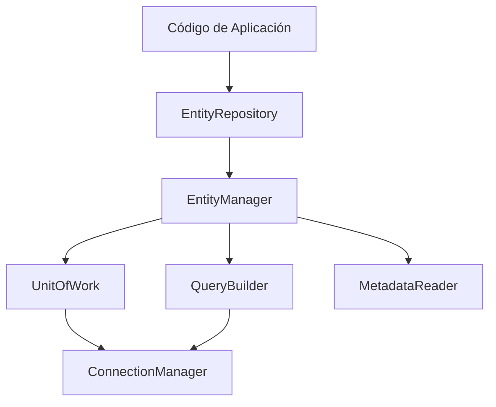

# Patrón Repository

El patrón Repository encapsula la lógica de acceso a datos para una entidad específica, proporcionando una interfaz orientada a colecciones que oculta los detalles de persistencia. En Sybase ORM, la clase `EntityRepository` actúa como repositorio base que delega internamente al `EntityManager`.

## Concepto

El repositorio es el punto de entrada principal para operaciones CRUD sobre una entidad. Los desarrolladores interactúan con repositorios en lugar de usar directamente el `EntityManager`, logrando:

- **Encapsulamiento**: la lógica de consultas queda centralizada por entidad
- **Reutilización**: métodos comunes (find, save, delete) disponibles sin código adicional
- **Extensibilidad**: repositorios personalizados permiten agregar consultas de dominio

## Clase Base: EntityRepository

La clase `SybaseORM\ORM\EntityRepository` se encuentra en `src/ORM/EntityRepository.php`. Su constructor recibe el `EntityManagerInterface` y el FQCN de la entidad gestionada:

```php
namespace SybaseORM\ORM;

class EntityRepository
{
    public function __construct(
        private readonly EntityManagerInterface $entityManager,
        private readonly string $entityClass,
    ) {}
}
```

El repositorio calcula internamente el nombre corto de la clase (sin namespace) para usarlo en consultas OQL.

## Obtención de un Repositorio

Se obtiene a través del `EntityManager`:

```php
$repo = $entityManager->getRepository(Producto::class);
```

## Métodos Disponibles

### Persistencia

| Método | Descripción |
|--------|-------------|
| `persist(object $entity): void` | Registra la entidad para inserción/actualización sin flush |
| `flush(): void` | Ejecuta todos los cambios pendientes en base de datos |
| `save(object $entity): void` | Persist + flush inmediato |
| `saveMany(array $entities): void` | Persiste múltiples entidades y ejecuta flush |
| `delete(object $entity): void` | Marca para eliminación + flush |
| `deleteMany(array $entities): void` | Elimina múltiples entidades + flush |
| `merge(object $entity): object` | Re-asocia una entidad detached |

### Consultas

| Método | Descripción |
|--------|-------------|
| `find(mixed $id): ?object` | Busca por ID primario; si recibe array, delega a `findOneBy()` |
| `findOrFail(mixed $id): object` | Igual que `find()` pero lanza `PersistenceException` si no existe |
| `findAll(): array` | Retorna todas las entidades (equivale a `findBy([])`) |
| `findBy(array $criteria, ?array $orderBy, ?int $limit, ?int $offset): array` | Búsqueda por criterios con ordenamiento y paginación |
| `findOneBy(array $criteria): ?object` | Retorna una entidad o null |
| `findOneByOrFail(array $criteria): object` | Lanza `PersistenceException` si no encuentra resultado |
| `query(string $oql, array $params): array` | Ejecuta OQL arbitrario |
| `queryIterator(string $oql, array $params): Generator` | Iterador para result sets grandes |
| `queryCached(string $oql, array $params, int $ttl): array` | Consulta con caché de segundo nivel |
| `queryScalar(string $oql, array $params): mixed` | Retorna un valor escalar |
| `executeUpdate(string $oql, array $params): int` | Ejecuta UPDATE/DELETE OQL, retorna filas afectadas |

### Conteo y Existencia

| Método | Descripción |
|--------|-------------|
| `count(array $criteria = []): int` | Cuenta entidades que cumplen los criterios |
| `exists(array $criteria): bool` | Verifica si existe al menos una entidad |

### QueryBuilder

| Método | Descripción |
|--------|-------------|
| `createQueryBuilder(): QueryBuilderInterface` | Crea un QueryBuilder pre-configurado para la entidad |

### Transacciones

| Método | Descripción |
|--------|-------------|
| `beginTransaction(): void` | Inicia transacción |
| `commit(): void` | Confirma transacción |
| `rollback(): void` | Revierte transacción |
| `transactional(callable $callback): mixed` | Ejecuta callback en transacción |

### Utilidades

| Método | Descripción |
|--------|-------------|
| `getEntityClass(): string` | Retorna el FQCN de la entidad |
| `getTableName(): string` | Retorna el nombre de tabla cualificado |
| `getEntityShortName(): string` | Nombre corto de la clase (sin namespace) |
| `refresh(object $entity): void` | Recarga la entidad desde la base de datos |

## Sistema de Criterios

Los métodos `findBy()`, `findOneBy()`, `count()` y `exists()` aceptan un array asociativo de criterios. El repositorio maneja tres tipos de valores:

```php
// Valor escalar → condición de igualdad
$repo->findBy(['status' => 'activo']);
// OQL generado: WHERE e.status = :p0

// Valor null → IS NULL
$repo->findBy(['deletedAt' => null]);
// OQL generado: WHERE e.deletedAt IS NULL

// Array → IN clause (con expansión automática)
$repo->findBy(['categoria' => ['A', 'B', 'C']]);
// OQL generado: WHERE e.categoria IN (:p0)
```

El soft delete se filtra automáticamente cuando la entidad usa `#[SoftDelete]`. Para incluir registros eliminados:

```php
$repo->findBy(['_withTrashed' => true, 'status' => 'inactivo']);
```

## Creación de Repositorios Personalizados

Para agregar consultas específicas de dominio, se extiende `EntityRepository`:

```php
namespace App\Repository;

use SybaseORM\ORM\EntityRepository;

class ProductoRepository extends EntityRepository
{
    /** @return Producto[] */
    public function findActivos(): array
    {
        return $this->findBy(['activo' => true], ['nombre' => 'ASC']);
    }

    /** @return Producto[] */
    public function findPorRangoPrecio(float $min, float $max): array
    {
        return $this->query(
            'SELECT p FROM Producto p WHERE p.precio >= :min AND p.precio <= :max',
            ['min' => $min, 'max' => $max]
        );
    }

    public function contarPorCategoria(int $categoriaId): int
    {
        return $this->count(['categoriaId' => $categoriaId]);
    }
}
```

Para registrar el repositorio personalizado, se pasa al obtenerlo o se configura en el atributo de la entidad. El `EntityManager` instanciará la clase proporcionada:

```php
$repo = $entityManager->getRepository(Producto::class);
// Retorna ProductoRepository si está configurado
```

## Interacción con Otros Componentes



El repositorio actúa como fachada: todas las operaciones se delegan al `EntityManager`, que coordina `UnitOfWork` para escrituras y el motor de consultas para lecturas.

## Método Protegido para Extensión

Los repositorios personalizados pueden acceder al `EntityManager` mediante:

```php
protected function getEntityManager(): EntityManagerInterface
```

Esto permite ejecutar operaciones avanzadas que no están expuestas directamente en la API pública del repositorio.

---

← [Anterior](./patron-proxy.md) | [Índice](./README.md) | [Siguiente →](./extension-tipos-personalizados.md)
