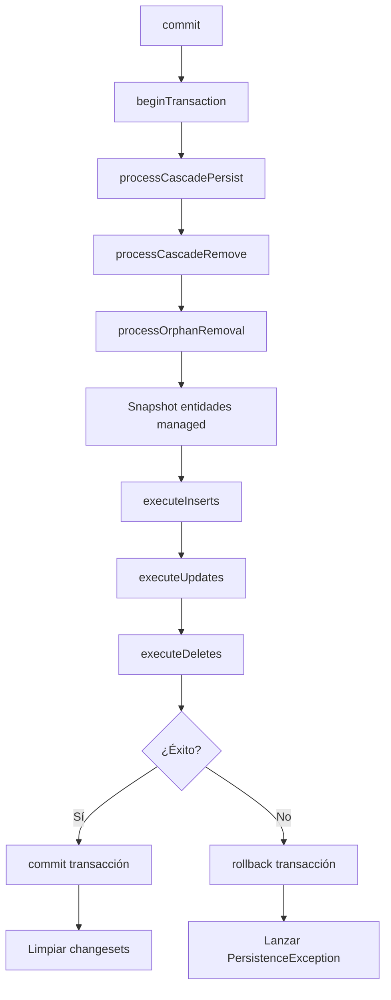
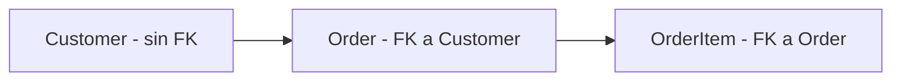

# Patrón Unit of Work

El Unit of Work es el componente central de coordinación de persistencia del ORM. Rastrea todas las entidades nuevas, modificadas y eliminadas durante una sesión de trabajo, y ejecuta los cambios pendientes dentro de una única transacción al invocar `commit()`.

La implementación se encuentra en `SybaseORM\ORM\UnitOfWork` y cumple el contrato definido por `SybaseORM\ORM\UnitOfWorkInterface`.

## Responsabilidades

- **Gestión del changeset**: registrar entidades nuevas (`registerNew`), limpias (`registerClean`) y eliminadas (`registerDeleted`).
- **Dirty checking**: detectar propiedades modificadas comparando el estado actual contra un snapshot tomado al registrar la entidad como limpia.
- **Orden de ejecución**: ejecutar INSERTs, UPDATEs y DELETEs en un orden que respeta dependencias de foreign keys.
- **Commit transaccional**: envolver todas las operaciones en una transacción con rollback automático ante errores.
- **Cascade y orphan removal**: propagar persist/remove a entidades relacionadas según la configuración de metadatos.

## Diagrama de Flujo del Commit



## Estructuras Internas

El `UnitOfWork` utiliza `SplObjectStorage` para rastrear entidades por referencia de objeto:

| Storage | Propósito |
|---------|-----------|
| `$newEntities` | Entidades pendientes de INSERT |
| `$deletedEntities` | Entidades pendientes de DELETE |
| `$entitySnapshots` | Snapshots de propiedades para dirty checking |
| `$insertedEntities` | Entidades ya insertadas (previene re-inserción) |

## Registro de Entidades

### `registerNew(object $entity): void`

Marca una entidad como nueva (pendiente de INSERT). Se ignora si la entidad ya tiene snapshot (está managed) o ya fue insertada en un commit anterior:

```php
public function registerNew(object $entity): void
{
    if ($this->entitySnapshots->contains($entity)) {
        return;
    }
    if ($this->insertedEntities->contains($entity)) {
        return;
    }
    $this->newEntities->attach($entity);
}
```

### `registerClean(object $entity): void`

Toma un snapshot del estado actual de todas las propiedades mapeadas. Este snapshot es la referencia para el dirty checking posterior:

```php
public function registerClean(object $entity): void
{
    $metadata = $this->metadataReader->getClassMetadata($entity::class);
    $snapshot = $this->takeSnapshot($entity, $metadata);
    $this->entitySnapshots->attach($entity, $snapshot);
}
```

El snapshot incluye valores de columnas y, para relaciones con `orphanRemoval=true`, una copia de la colección actual.

### `registerDeleted(object $entity): void`

Marca la entidad para eliminación en el próximo commit.

## Dirty Checking

El método `computeChangeset()` compara cada propiedad mapeada contra el snapshot almacenado:

```php
public function computeChangeset(object $entity): array
{
    $metadata = $this->metadataReader->getClassMetadata($entity::class);
    $snapshot = $this->entitySnapshots[$entity];
    $changeset = [];

    foreach ($metadata->columns as $column) {
        $currentValue = $this->getEntityPropertyValue($entity, $column->propertyName);
        $oldValue = $snapshot[$column->propertyName] ?? null;

        if ($currentValue !== $oldValue) {
            $changeset[$column->propertyName] = [
                'old' => $oldValue,
                'new' => $currentValue,
            ];
        }
    }
    return $changeset;
}
```

La comparación utiliza identidad estricta (`!==`). Soporta notación con punto para propiedades embebidas (ej: `address.street`).

## Orden de Ejecución en el Commit

El método `commit()` ejecuta las operaciones en un orden específico:

1. **Cascade persist** — descubre entidades relacionadas con `cascade=['persist']` y las registra como nuevas.
2. **Cascade remove** — descubre entidades relacionadas con `cascade=['remove']` y las registra para eliminación.
3. **Orphan removal** — compara colecciones actuales contra snapshots para detectar ítems huérfanos.
4. **INSERTs** — ordena entidades por dependencias FK (topological sort) y ejecuta inserts. Tras cada insert recupera `@@identity` y propaga el ID generado a entidades dependientes.
5. **UPDATEs** — solo para entidades managed antes del commit actual. Ejecuta UPDATE parcial (solo columnas modificadas) si el changeset no está vacío.
6. **DELETEs** — ejecuta DELETE físico o soft delete (UPDATE con `GETDATE()`) según la configuración de la entidad.

### Ordenamiento de INSERTs

El método `orderEntitiesForInsert()` construye un grafo de dependencias basado en relaciones `ManyToOne`/`OneToOne` con `joinColumn`, y aplica un ordenamiento topológico. Si detecta dependencia circular, lanza `PersistenceException`.



En este ejemplo, el orden de inserción sería: Customer → Order → OrderItem.

### Propagación de IDs Generados

Después de cada INSERT con identity/autoincrement, el UoW:

1. Recupera el ID generado via `SELECT @@identity`.
2. Asigna el valor a la propiedad ID de la entidad vía Reflection.
3. Registra la entidad en el Identity Map.
4. Propaga el ID a entidades dependientes que tienen una FK apuntando a la entidad recién insertada.

### Updates Parciales

Solo se generan sentencias UPDATE para las columnas que realmente cambiaron. Las columnas ID nunca se incluyen en el UPDATE. Se usan hooks `PreUpdate`/`PostUpdate` antes y después de la ejecución.

### Soft Delete

Si la entidad tiene configurado `softDeleteColumn`, el DELETE se convierte en:

```sql
UPDATE tabla SET deleted_at = GETDATE() WHERE id = ?
```

## Transaccionalidad

Todo el commit se envuelve en `beginTransaction()`/`commit()`. Si cualquier operación falla:

1. Se ejecuta `rollback()` de forma segura (suprimiendo errores secundarios).
2. Se relanza la excepción original envuelta en `PersistenceException`.

```php
try {
    $this->connectionManager->beginTransaction();
    // ... operaciones ...
    $this->connectionManager->commit();
} catch (\Throwable $e) {
    $this->safeRollback();
    throw new PersistenceException('Flush failed: ' . $e->getMessage(), 0, $e);
}
```

## Métodos de Control

| Método | Descripción |
|--------|-------------|
| `clear()` | Limpia todos los registros, snapshots y el Identity Map |
| `isManaged($entity)` | Verifica si la entidad tiene snapshot (está tracked) |
| `detach($entity)` | Remueve la entidad de todos los storages de tracking |
| `clearClass($class)` | Remueve todas las entidades de una clase específica |

## Dependencias

El `UnitOfWork` recibe sus dependencias por constructor:

- `ConnectionManagerInterface` — ejecución de SQL y gestión de transacciones.
- `MetadataReaderInterface` — lectura de metadatos de clase (columnas, relaciones).
- `DialectInterface` — generación de SQL específico de Sybase (INSERT, UPDATE, DELETE).
- `TypeCasterInterface` — conversión de tipos PHP ↔ base de datos.
- `IdentityMapInterface` — registro/remoción de entidades por identidad.
- `HookDispatcher` (opcional) — despacho de hooks de ciclo de vida.

## Optimizaciones

- **Caché de ReflectionProperty**: las instancias de `ReflectionProperty` se cachean en un array interno (`$reflectionCache`) para evitar recrearlas en cada operación.
- **Prevención de doble INSERT**: `$insertedEntities` evita que una entidad sea insertada dos veces si se llama `commit()` múltiples veces sin `clear()`.
- **Updates parciales**: solo las columnas dirty se incluyen en el UPDATE, reduciendo el tráfico de red y la carga en el servidor.

---

← [Anterior](./organizacion-codigo.md) | [Índice](./README.md) | [Siguiente →](./patron-identity-map.md)
